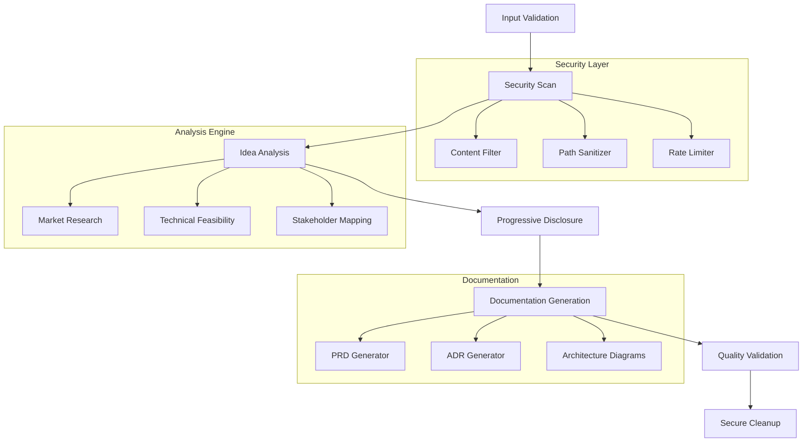

# Secure Idea-to-PRD Claude Code Skill

> Transform product ideas into comprehensive, security-first Product Requirements Documents through progressive analysis and structured methodology.

[](./CHANGELOG.md)
[](./SECURITY.md)
[](./LICENSE)

## 🚀 Quick Start

```bash
# Install Claude Flow CLI
npm install -g @claude-flow/cli

# Add the skill to Claude Code
claude skill add idea-to-prd

# Basic usage - simple idea analysis
claude skill invoke idea-to-prd "AI-powered task management app"

# Advanced usage - comprehensive analysis with stakeholders
claude skill invoke idea-to-prd "Enterprise automation tool" --stakeholders "DevOps,Security,Business" --include-market-research
```

## 📋 Table of Contents

- [Features](#-features)
- [Installation](#-installation)
- [Usage](#-usage)
- [Security](#-security)
- [Examples](#-examples)
- [API Documentation](#-api-documentation)
- [Troubleshooting](#-troubleshooting)
- [Contributing](#-contributing)

## ✨ Features

### 🛡️ Security-First Design
- **Input Validation**: Comprehensive schema validation for all inputs
- **Content Filtering**: Automatic detection and masking of sensitive data
- **Path Sanitization**: Safe file handling with directory traversal prevention
- **Rate Limiting**: Built-in throttling to prevent abuse
- **Secure Cleanup**: Automatic cleanup of temporary files and sensitive data

### 🔄 Progressive Disclosure
- **Phased Analysis**: Break down complex ideas into manageable phases
- **Checkpoint System**: Manual checkpoints for critical decision points
- **Stakeholder Mapping**: Identify and engage relevant stakeholders
- **Risk Assessment**: Built-in security and technical risk evaluation

### 📊 Comprehensive Documentation
- **Structured PRDs**: Industry-standard Product Requirements Documents
- **Architecture Decisions**: ADR (Architecture Decision Records) generation
- **Domain Modeling**: Domain-Driven Design (DDD) analysis
- **Technical Specifications**: C4 model diagrams and technical documentation

### 🤖 AI-Powered Analysis
- **Market Research**: Automated competitive analysis
- **Technical Feasibility**: Architecture and implementation recommendations
- **Security Assessment**: Threat modeling and security requirements
- **Quality Metrics**: Fitness functions and validation criteria

## 🛠️ Installation

### Prerequisites

- Node.js 18+
- Claude Code or Claude Flow CLI
- Git (for version control integration)

### Install via CLI

```bash
# Install Claude Flow CLI globally
npm install -g @claude-flow/cli

# Add the skill to your Claude environment
claude skill add idea-to-prd

# Verify installation
claude skill list | grep idea-to-prd
```

### Manual Installation

```bash
# Clone the repository
git clone https://github.com/your-org/claude-skill-idea-to-prd.git
cd claude-skill-idea-to-prd

# Install dependencies
npm install

# Build the skill
npm run build

# Link to Claude Code
claude skill link .
```

## 🎯 Usage

### Basic Idea Analysis

Transform a simple idea into a structured PRD:

```bash
claude skill invoke idea-to-prd "AI-powered code review assistant"
```

### Advanced Analysis with Options

```bash
claude skill invoke idea-to-prd \
  --idea "Decentralized identity platform" \
  --stakeholders "Security,DevOps,Legal,Business" \
  --include-market-research true \
  --security-level high \
  --output-format comprehensive
```

### Progressive Analysis with Checkpoints

```bash
claude skill invoke idea-to-prd \
  --idea "Enterprise automation tool" \
  --mode manual \
  --checkpoints true
```

### Programmatic Usage

```javascript
const { ideaToPrd } = require('@claude-flow/idea-to-prd');

const result = await ideaToPrd.process({
  idea: "AI-powered task management app",
  options: {
    includeMarketResearch: true,
    securityLevel: "high",
    outputFormat: "comprehensive",
    stakeholders: ["Product", "Engineering", "Security"]
  }
});

console.log(result.prd);
```

## 🔒 Security

This skill implements enterprise-grade security measures:

- **Zero-Trust Architecture**: All inputs validated and sanitized
- **Data Minimization**: Only collect and process necessary data
- **Encryption**: All temporary files encrypted at rest
- **Audit Logging**: Complete audit trail of all operations
- **GDPR Compliance**: Privacy-by-design implementation

See [SECURITY.md](./SECURITY.md) for detailed security documentation.

## 📚 Examples

### Quick Examples

| Scenario | Command | Description |
|----------|---------|-------------|
| **E-commerce Platform** | `claude skill invoke idea-to-prd "Online marketplace for handmade goods"` | Complete PRD with payment, catalog, and user management |
| **Mobile Health App** | `claude skill invoke idea-to-prd "Fitness tracking app with social features"` | PRD with HIPAA considerations and social architecture |
| **B2B SaaS Tool** | `claude skill invoke idea-to-prd "Project management tool for remote teams"` | Enterprise PRD with security and scalability focus |
| **API Service** | `claude skill invoke idea-to-prd "Real-time notification service"` | Technical PRD with API specifications and architecture |

### Detailed Examples

Explore comprehensive examples in the [examples/](./examples/) directory:

- [E-commerce Platform](./examples/ecommerce-platform/)
- [Mobile Health App](./examples/mobile-health-app/)
- [B2B SaaS Platform](./examples/b2b-saas-platform/)
- [API Microservice](./examples/api-microservice/)

## 📖 API Documentation

### Input Parameters

| Parameter | Type | Required | Description |
|-----------|------|----------|-------------|
| `idea` | string | ✅ | The product idea or problem statement |
| `stakeholders` | string[] | ❌ | List of stakeholder roles |
| `include-market-research` | boolean | ❌ | Enable automated market research |
| `security-level` | enum | ❌ | Security requirements (low/medium/high) |
| `output-format` | enum | ❌ | Output format (summary/comprehensive/technical) |
| `mode` | enum | ❌ | Processing mode (auto/manual) |

### Output Structure

```typescript
interface IdeaToPrdResult {
  prd: {
    executive_summary: string;
    requirements: Requirement[];
    architecture: ArchitectureDecision[];
    security: SecurityAssessment;
    implementation: ImplementationPlan;
  };
  metadata: {
    processing_time: number;
    security_score: number;
    completeness_score: number;
  };
  files: GeneratedFile[];
}
```

See [API-DOCUMENTATION.md](./API-DOCUMENTATION.md) for complete API reference.

## 🐛 Troubleshooting

### Common Issues

#### "Input validation failed"
**Cause**: Input exceeds maximum length or contains invalid characters
**Solution**: Check input length (max 10,000 characters) and remove special characters

```bash
# Check input length
echo "Your idea here" | wc -c

# Clean input
echo "Your idea" | tr -d '\n\r\t'
```

#### "Market research timeout"
**Cause**: Network connectivity issues or API rate limits
**Solution**: Disable market research or check network connection

```bash
# Disable market research
claude skill invoke idea-to-prd "Your idea" --include-market-research false
```

#### "Security scan failed"
**Cause**: Input contains potentially sensitive information
**Solution**: Review and sanitize input before processing

```bash
# Check for sensitive patterns
grep -E "(password|key|token|secret)" your-input.txt
```

### Performance Issues

#### Slow processing
- **Cause**: Large input or comprehensive analysis mode
- **Solution**: Use summary mode or break down large ideas

#### Memory issues
- **Cause**: Multiple concurrent analyses
- **Solution**: Process ideas sequentially or increase system memory

### Debug Mode

Enable debug logging for detailed troubleshooting:

```bash
DEBUG=idea-to-prd:* claude skill invoke idea-to-prd "Your idea"
```

## 🏗️ Architecture



## 🤝 Contributing

We welcome contributions! Please see our [Contributing Guide](./CONTRIBUTING.md) for details.

### Development Setup

```bash
git clone https://github.com/your-org/claude-skill-idea-to-prd.git
cd claude-skill-idea-to-prd
npm install
npm run dev
```

### Running Tests

```bash
npm test                # Unit tests
npm run test:integration # Integration tests
npm run test:security    # Security tests
```

## 📄 License

This project is licensed under the MIT License - see the [LICENSE](./LICENSE) file for details.

## 📞 Support

- **Documentation**: [Full documentation](https://docs.claude-flow.com/skills/idea-to-prd)
- **Issues**: [GitHub Issues](https://github.com/your-org/claude-skill-idea-to-prd/issues)
- **Discussions**: [GitHub Discussions](https://github.com/your-org/claude-skill-idea-to-prd/discussions)
- **Security**: [Security Policy](./SECURITY.md)

## 🙏 Acknowledgments

- Claude Flow team for the foundational framework
- Security research community for threat modeling guidance
- Product management community for PRD best practices
- Open source contributors and maintainers

---

**Built with ❤️ by the Claude Flow community**

## Directory Structure

```
claude-skill-idea_to_PRD/
├── SKILL.md                     # Main skill definition
├── README.md                    # This documentation
├── examples/                    # Usage examples and demos
│   ├── basic-idea-analysis.md
│   ├── enterprise-app-prd.md
│   └── mobile-app-requirements.md
├── templates/                   # Secure document templates
│   ├── prd-template.md          # Product Requirements Document
│   ├── adr-template.md          # Architecture Decision Record
│   ├── ddd-template.md          # Domain-Driven Design
│   └── c4-template.md           # C4 Model Diagram
├── schemas/                     # Input/output validation
│   ├── idea-input.schema.json
│   ├── prd-output.schema.json
│   └── stakeholder.schema.json
├── security/                    # Security documentation
│   ├── threat-model.md
│   ├── data-handling.md
│   └── compliance.md
└── tests/                       # Test scenarios
    ├── unit/
    ├── integration/
    └── security/
```

## Security Model

This skill implements defense-in-depth security:

### Input Security
- **Validation**: All inputs validated against JSON schemas
- **Sanitization**: HTML/script tag removal and encoding
- **Length Limits**: Configurable maximum input lengths
- **Content Filtering**: PII and sensitive data detection

### Processing Security
- **Sandboxed Execution**: Isolated working directories
- **Path Sanitization**: Prevention of directory traversal
- **Resource Limits**: Memory and execution time bounds
- **Audit Logging**: Complete audit trail of operations

### Output Security
- **Content Filtering**: Sensitive data masking in outputs
- **Secure Cleanup**: Automatic cleanup of temporary files
- **Access Controls**: Role-based access to generated documents
- **Encryption**: Optional encryption of sensitive outputs

## Progressive Disclosure

The skill supports progressive analysis through phases:

1. **Initial Analysis** (30 seconds)
   - Core concept extraction
   - Basic stakeholder identification
   - High-level feasibility check

2. **Requirements Discovery** (2-3 minutes)
   - Functional requirements mapping
   - Non-functional requirements analysis
   - User story generation

3. **Technical Analysis** (3-5 minutes)
   - Architecture recommendations
   - Technology stack suggestions
   - Integration requirements

4. **Market Research** (5-10 minutes)
   - Competitive analysis
   - Market sizing estimates
   - Risk assessment

5. **Comprehensive PRD** (10-15 minutes)
   - Complete document generation
   - Visual diagrams and mockups
   - Implementation roadmap

## Template System

### PRD Template
Comprehensive Product Requirements Document with:
- Executive Summary
- Product Vision & Goals
- User Personas & Journeys
- Functional Requirements
- Non-Functional Requirements
- Technical Architecture
- Security Requirements
- Success Metrics
- Risks & Mitigation
- Implementation Timeline

### ADR Template
Architecture Decision Records for:
- Context and problem statement
- Decision drivers and constraints
- Considered options
- Decision outcome and rationale
- Consequences and trade-offs

### DDD Template
Domain-Driven Design analysis including:
- Bounded contexts identification
- Domain entities and aggregates
- Ubiquitous language definition
- Context mapping
- Strategic design decisions

## Configuration

### Environment Variables
```bash
export IDEA_TO_PRD_MAX_INPUT_LENGTH=10000
export IDEA_TO_PRD_SECURITY_LEVEL=high
export IDEA_TO_PRD_ENABLE_MARKET_RESEARCH=true
export IDEA_TO_PRD_OUTPUT_DIR=/secure/outputs
```

### Config File
```json
{
  "security": {
    "maxInputLength": 10000,
    "contentFiltering": true,
    "rateLimitRpm": 60,
    "auditLogging": true
  },
  "features": {
    "marketResearch": true,
    "technicalAnalysis": true,
    "stakeholderMapping": true,
    "visualDiagrams": true
  },
  "outputs": {
    "defaultFormat": "comprehensive",
    "includeVisuals": true,
    "autoSave": true,
    "encryptSensitive": true
  },
  "integrations": {
    "github": true,
    "jira": true,
    "confluence": true,
    "slack": true
  }
}
```

## Performance Metrics

| Operation | Typical Duration | Memory Usage |
|-----------|------------------|--------------|
| Basic Analysis | 10-30 seconds | <50MB |
| Requirements Discovery | 1-3 minutes | <75MB |
| Technical Analysis | 2-5 minutes | <100MB |
| Comprehensive PRD | 5-15 minutes | <150MB |

## Error Handling

The skill provides graceful error handling:

- **Validation Errors**: Clear messages for input problems
- **Network Errors**: Retry logic with exponential backoff
- **Rate Limiting**: Automatic throttling and queuing
- **Resource Errors**: Graceful degradation when limits hit
- **Security Errors**: Immediate termination with audit logs

## Testing

### Unit Tests
```bash
npm run test:unit
```

### Integration Tests
```bash
npm run test:integration
```

### Security Tests
```bash
npm run test:security
```

### Performance Tests
```bash
npm run test:performance
```

## Contributing

1. Fork the repository
2. Create a feature branch
3. Add tests for new functionality
4. Ensure security review compliance
5. Submit pull request with detailed description

## Support

- **Documentation**: Full API docs in `/docs`
- **Issues**: GitHub Issues for bug reports
- **Security**: security@example.com for security issues
- **Community**: Discord/Slack for general questions

## License

MIT License - see LICENSE file for details

## Security Disclosure

Please report security vulnerabilities responsibly through our security contact rather than public issues.