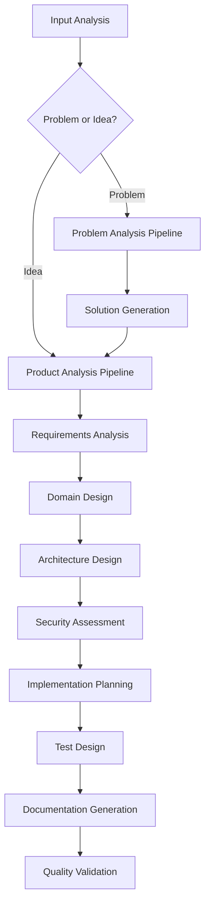

# API Documentation - Idea-to-PRD Skill

## Overview

This document provides comprehensive API documentation for the Secure Idea-to-PRD Claude Code Skill. The skill transforms product ideas and problems into comprehensive Product Requirements Documents through structured analysis and progressive disclosure.

## Table of Contents

- [Skill Interface](#skill-interface)
- [Input Specifications](#input-specifications)
- [Output Specifications](#output-specifications)
- [Processing Phases](#processing-phases)
- [Checkpoint System](#checkpoint-system)
- [Security Model](#security-model)
- [Error Handling](#error-handling)
- [Examples](#examples)

## Skill Interface

### Basic Invocation

```bash
claude skill invoke idea-to-prd [options]
```

### Command Line Interface

```bash
# Basic usage
claude skill invoke idea-to-prd "AI-powered task management app"

# Full parameter specification
claude skill invoke idea-to-prd \
  --idea "Enterprise automation platform" \
  --stakeholders "Product,Engineering,Security,Legal" \
  --include-market-research true \
  --security-level high \
  --output-format comprehensive \
  --mode manual \
  --checkpoints true
```

### Programmatic Interface

```javascript
const { ideaToPrd } = require('@claude-flow/idea-to-prd');

// Basic usage
const result = await ideaToPrd.process({
  idea: "AI-powered task management app"
});

// Advanced usage with full options
const result = await ideaToPrd.process({
  idea: "Enterprise automation platform",
  options: {
    stakeholders: ["Product", "Engineering", "Security", "Legal"],
    includeMarketResearch: true,
    securityLevel: "high",
    outputFormat: "comprehensive",
    mode: "manual",
    checkpoints: true
  }
});
```

## Input Specifications

### Required Parameters

#### `idea` (string, required)
The core product idea or problem statement to be analyzed.

**Constraints:**
- Minimum length: 10 characters
- Maximum length: 10,000 characters
- Allowed characters: Alphanumeric, punctuation, whitespace
- Encoding: UTF-8

**Examples:**
```javascript
// Simple idea
{
  "idea": "AI-powered fitness tracking app"
}

// Complex idea with context
{
  "idea": "Enterprise-grade project management platform for distributed teams with real-time collaboration, AI-powered insights, and comprehensive security controls targeting Fortune 500 companies"
}

// Problem statement
{
  "idea": "Problem: Remote teams struggle with maintaining productivity and collaboration across time zones, leading to project delays and reduced team morale. Current tools are fragmented and lack intelligent coordination."
}
```

### Optional Parameters

#### `stakeholders` (array of strings, optional)
List of stakeholder roles involved in the project.

**Format:**
```javascript
{
  "stakeholders": ["Product", "Engineering", "Design", "Security", "Legal"]
}
```

**Predefined Stakeholder Roles:**
- `Product` - Product management and strategy
- `Engineering` - Technical development and architecture
- `Design` - User experience and interface design
- `Security` - Information security and compliance
- `Legal` - Legal compliance and risk management
- `Marketing` - Market analysis and positioning
- `Operations` - Business operations and support
- `Finance` - Financial planning and analysis
- `Customer` - Customer success and support
- `Business` - General business stakeholders

**Custom Stakeholders:**
```javascript
{
  "stakeholders": ["DataScience", "DevOps", "Compliance", "CustomerSuccess"]
}
```

#### `includeMarketResearch` (boolean, optional, default: false)
Enable automated market research and competitive analysis.

**Impact:**
- Adds 5-10 minutes to processing time
- Requires internet connectivity
- Provides competitive landscape analysis
- Includes market sizing estimates

```javascript
{
  "includeMarketResearch": true
}
```

#### `securityLevel` (enum, optional, default: "medium")
Security assessment depth and focus.

**Options:**
- `"low"` - Basic security considerations
- `"medium"` - Standard security assessment (default)
- `"high"` - Comprehensive security analysis
- `"critical"` - Maximum security focus (healthcare, financial, etc.)

**Impact by Level:**
```javascript
{
  "securityLevel": "high",
  // Generates:
  // - Complete threat model (STRIDE analysis)
  // - Security requirements specification
  // - Privacy impact assessment
  // - Compliance mapping (GDPR, SOC2, etc.)
  // - Security architecture decisions
}
```

#### `outputFormat` (enum, optional, default: "comprehensive")
Determines the depth and format of generated documentation.

**Options:**
- `"summary"` - Executive summary and key highlights (5-10 pages)
- `"comprehensive"` - Complete documentation package (30-50 pages)
- `"technical"` - Technical focus with architecture emphasis (20-30 pages)

**Format Comparison:**
| Component | Summary | Comprehensive | Technical |
|-----------|---------|---------------|-----------|
| Executive Summary | ✅ | ✅ | ✅ |
| Requirements | Basic | Detailed | Detailed |
| Architecture | High-level | Complete | Deep-dive |
| Security Assessment | Basic | Complete | Advanced |
| Implementation Guide | Outline | Detailed | Code-focused |
| Test Scenarios | Key flows | Complete | Technical tests |

#### `mode` (enum, optional, default: "auto")
Processing mode determining user interaction level.

**Options:**
- `"auto"` - Fully automated processing with minimal user interaction
- `"manual"` - Interactive processing with checkpoint confirmations

**Auto Mode:**
- Fast processing (10-30 minutes)
- Minimal user input required
- Best practices and assumptions applied
- Suitable for MVPs and initial exploration

**Manual Mode:**
- Detailed processing (30-90 minutes)
- 9 checkpoint confirmations
- User control over each phase
- Suitable for critical business systems

#### `checkpoints` (boolean, optional, default: false)
Enable checkpoint confirmations during processing (requires `mode: "manual"`).

**Checkpoint Flow:**
```
Input Analysis → ⏸️ Checkpoint 1: Confirm requirements
Requirements → ⏸️ Checkpoint 2: Confirm domain design
Architecture → ⏸️ Checkpoint 3: Confirm technical decisions
Security → ⏸️ Checkpoint 4: Confirm security model
Implementation → ⏸️ Checkpoint 5: Confirm approach
Testing → ⏸️ Checkpoint 6: Confirm test strategy
```

### Input Validation Schema

```json
{
  "$schema": "https://json-schema.org/draft/2020-12/schema",
  "type": "object",
  "properties": {
    "idea": {
      "type": "string",
      "minLength": 10,
      "maxLength": 10000,
      "pattern": "^[\\w\\s\\.,!?;:()\\-'\"\\n\\r]*$"
    },
    "stakeholders": {
      "type": "array",
      "items": {
        "type": "string",
        "pattern": "^[A-Za-z0-9\\-_]{2,20}$"
      },
      "maxItems": 10,
      "uniqueItems": true
    },
    "includeMarketResearch": {
      "type": "boolean"
    },
    "securityLevel": {
      "type": "string",
      "enum": ["low", "medium", "high", "critical"]
    },
    "outputFormat": {
      "type": "string",
      "enum": ["summary", "comprehensive", "technical"]
    },
    "mode": {
      "type": "string",
      "enum": ["auto", "manual"]
    },
    "checkpoints": {
      "type": "boolean"
    }
  },
  "required": ["idea"],
  "additionalProperties": false
}
```

## Output Specifications

### Return Value Structure

```typescript
interface IdeaToPrdResult {
  // Processing metadata
  metadata: ProcessingMetadata;

  // Generated documentation
  documents: GeneratedDocuments;

  // Analysis results
  analysis: AnalysisResults;

  // Generated files
  files: GeneratedFile[];

  // Quality metrics
  quality: QualityMetrics;
}
```

### Processing Metadata

```typescript
interface ProcessingMetadata {
  // Processing information
  processingId: string;
  startTime: string;        // ISO 8601 timestamp
  endTime: string;          // ISO 8601 timestamp
  processingTime: number;   // Duration in seconds

  // Input analysis
  inputType: "idea" | "problem";
  inputLength: number;
  stakeholderCount: number;

  // Processing configuration
  securityLevel: SecurityLevel;
  outputFormat: OutputFormat;
  mode: ProcessingMode;
  checkpointsUsed: boolean;

  // Phase execution
  phasesExecuted: ProcessingPhase[];
  checkpointsPassed: number;

  // Quality indicators
  completenessScore: number;     // 0-100
  securityScore: number;         // 0-100
  feasibilityScore: number;      // 0-100
}
```

### Generated Documents

```typescript
interface GeneratedDocuments {
  // Core documentation
  prd: ProductRequirementsDocument;
  executiveSummary: ExecutiveSummary;

  // Architecture documentation
  architecture: ArchitectureDocumentation;

  // Security documentation
  security: SecurityDocumentation;

  // Implementation guidance
  implementation: ImplementationGuidance;

  // Testing specifications
  testing: TestingSpecifications;
}
```

#### Product Requirements Document

```typescript
interface ProductRequirementsDocument {
  // Document metadata
  version: string;
  lastUpdated: string;
  author: string;

  // Executive information
  executiveSummary: string;
  productVision: string;
  businessObjectives: string[];

  // User analysis
  userPersonas: UserPersona[];
  userJourneys: UserJourney[];

  // Requirements
  functionalRequirements: FunctionalRequirement[];
  nonFunctionalRequirements: NonFunctionalRequirement[];

  // Business context
  marketAnalysis: MarketAnalysis;
  competitiveAnalysis: CompetitiveAnalysis;

  // Success criteria
  successMetrics: SuccessMetric[];
  acceptanceCriteria: AcceptanceCriteria[];

  // Risk assessment
  risks: Risk[];
  mitigations: Mitigation[];

  // Implementation
  roadmap: ImplementationRoadmap;
  resourceRequirements: ResourceRequirement[];
}
```

#### Functional Requirement Structure

```typescript
interface FunctionalRequirement {
  id: string;                    // FR-001, FR-002, etc.
  title: string;
  description: string;
  priority: "Must" | "Should" | "Could" | "Won't";  // MoSCoW
  userStory: string;             // As a... I want... So that...
  acceptanceCriteria: string[];
  dependencies: string[];        // Other requirement IDs
  estimatedEffort: "XS" | "S" | "M" | "L" | "XL";
  businessValue: number;         // 1-10 scale
  technicalComplexity: number;   // 1-10 scale
  riskLevel: "Low" | "Medium" | "High";
  verification: string;          // How to verify implementation
}
```

### Analysis Results

```typescript
interface AnalysisResults {
  // Domain analysis
  domainModel: DomainModel;

  // Technical analysis
  technologyRecommendations: TechnologyRecommendation[];
  architectureDecisions: ArchitectureDecision[];

  // Business analysis
  businessModel: BusinessModel;
  revenueProjections: RevenueProjection[];

  // Risk analysis
  technicalRisks: TechnicalRisk[];
  businessRisks: BusinessRisk[];
  securityRisks: SecurityRisk[];
}
```

### Generated Files

```typescript
interface GeneratedFile {
  path: string;                  // Relative file path
  name: string;                  // File name
  type: FileType;                // Document type
  format: "markdown" | "json" | "yaml" | "pseudo";
  size: number;                  // File size in bytes
  checksum: string;              // SHA-256 checksum
  content?: string;              // File content (if requested)
  description: string;           // File description
}

type FileType =
  | "prd"              // Product Requirements Document
  | "adr"              // Architecture Decision Record
  | "ddd-strategic"    // Domain-Driven Design Strategic
  | "ddd-tactical"     // Domain-Driven Design Tactical
  | "c4-diagram"       // C4 Model Diagram
  | "threat-model"     // Security Threat Model
  | "test-scenarios"   // Test Scenarios
  | "pseudocode"       // Implementation Pseudocode
  | "completion"       // Completion Checklist
  | "ai-context";      // AI Development Context
```

### Quality Metrics

```typescript
interface QualityMetrics {
  // Completeness metrics
  requirementsCoverage: number;      // Percentage of standard requirements covered
  architectureCoverage: number;      // Architecture decision completeness
  securityCoverage: number;          // Security requirement completeness
  testCoverage: number;              // Test scenario coverage

  // Quality indicators
  requirementClarity: number;        // Clarity score (1-10)
  architectureCoherence: number;     // Architectural consistency (1-10)
  implementationFeasibility: number; // Technical feasibility (1-10)

  // Quantitative metrics
  functionalRequirements: number;    // Count of functional requirements
  nonFunctionalRequirements: number; // Count of non-functional requirements
  architectureDecisions: number;     // Count of ADRs
  securityControls: number;          // Count of security controls
  testScenarios: number;             // Count of test scenarios

  // Validation results
  validationPassed: boolean;
  validationErrors: ValidationError[];
  qualityGate: "Pass" | "Fail" | "Warning";
}
```

## Processing Phases

### Phase Overview

The skill processes ideas through multiple structured phases:



### Phase Details

#### Phase 1: Input Analysis (30-60 seconds)
**Purpose:** Analyze and classify input, determine processing strategy

**Activities:**
- Input validation and sanitization
- Content classification (idea vs. problem)
- Stakeholder identification
- Initial feasibility assessment
- Processing strategy determination

**Output:**
- Input classification result
- Stakeholder mapping
- Processing plan
- Initial risk assessment

#### Phase 2: Problem Analysis Pipeline (10-20 minutes, if problem input)
**Purpose:** Transform problem into solution idea

**Sub-phases:**
1. **Problem Exploration** (using explore skill)
   - Problem space analysis
   - Root cause investigation
   - Stakeholder impact assessment

2. **Research** (using goap-research skill)
   - Market research
   - Solution analysis
   - Technology investigation

3. **Solution Generation** (using problem-solver-enhanced skill)
   - Multiple problem-solving frameworks
   - Solution synthesis
   - Recommendation generation

#### Phase 3: Requirements Analysis (5-10 minutes)
**Purpose:** Extract and structure product requirements

**Activities:**
- Functional requirement extraction
- Non-functional requirement analysis
- User story generation
- Acceptance criteria definition
- Priority assignment (MoSCoW)

**Output:**
- Functional requirements (15+ items)
- Non-functional requirements (8+ items)
- User stories (5+ items)
- Priority matrix
- Dependencies mapping

#### Phase 4: Domain Design (5-15 minutes)
**Purpose:** Apply Domain-Driven Design methodology

**Strategic Design:**
- Bounded context identification
- Context mapping
- Ubiquitous language definition
- Subdomain classification

**Tactical Design:**
- Aggregate identification
- Entity and value object design
- Domain event specification
- Repository pattern definition

#### Phase 5: Architecture Design (10-20 minutes)
**Purpose:** Define technical architecture and decisions

**Activities:**
- Architecture decision records (ADRs)
- C4 model diagram generation
- Technology stack recommendations
- Integration pattern design
- Scalability planning

**Output:**
- 10+ Architecture Decision Records
- C4 Level 1-3 diagrams
- Technology recommendations
- Integration specifications
- Performance requirements

#### Phase 6: Security Assessment (5-15 minutes)
**Purpose:** Comprehensive security analysis

**Activities:**
- Threat modeling (STRIDE methodology)
- Security requirement specification
- Privacy impact assessment
- Compliance requirement mapping
- Security control recommendation

**Output:**
- Threat model documentation
- Security requirements
- Privacy assessment
- Compliance mapping
- Security architecture

#### Phase 7: Implementation Planning (5-10 minutes)
**Purpose:** Create implementation guidance

**Activities:**
- Pseudocode generation for core algorithms
- Development methodology recommendations
- Resource requirement estimation
- Timeline and milestone planning
- Technology setup guidance

**Output:**
- Pseudocode files for key components
- Implementation roadmap
- Resource estimates
- Setup instructions
- Best practices guide

#### Phase 8: Test Design (5-10 minutes)
**Purpose:** Comprehensive testing strategy

**Activities:**
- Test scenario generation (Gherkin format)
- User acceptance test specification
- Performance testing requirements
- Security testing procedures
- Quality assurance planning

**Output:**
- Gherkin test scenarios
- UAT specifications
- Performance test plans
- Security test procedures
- Quality metrics

#### Phase 9: Documentation Generation (2-5 minutes)
**Purpose:** Compile and format all documentation

**Activities:**
- Document compilation and formatting
- Cross-reference generation
- Index creation
- Quality validation
- Output packaging

**Output:**
- Complete documentation package
- File structure organization
- Navigation indices
- Quality reports
- Delivery package

## Checkpoint System

### Manual Mode Checkpoints

When using `mode: "manual"` with `checkpoints: true`, the skill pauses for user confirmation at key decision points:

#### Checkpoint 1: Requirements Validation
**Trigger:** After requirements analysis completion
**Purpose:** Validate functional and non-functional requirements

**User Options:**
```bash
# Continue with current requirements
"ok" | "continue" | "proceed"

# Modify specific requirements
"modify FR-001 to include real-time sync"
"add requirement for mobile offline support"
"change priority of FR-005 to Must Have"

# Add missing requirements
"add requirement for multi-language support"
"include accessibility compliance requirements"

# Request clarification
"clarify performance requirements"
"expand security requirements for financial data"
```

#### Checkpoint 2: Domain Design Review
**Trigger:** After domain design completion
**Purpose:** Review bounded contexts and domain model

**User Options:**
```bash
# Approve domain design
"ok" | "approve" | "looks good"

# Modify domain boundaries
"merge user and profile contexts"
"split payment processing into separate context"

# Adjust domain model
"add aggregate for subscription management"
"modify user entity to include preferences"

# Request changes
"reconsider payment processing approach"
"simplify domain model for MVP"
```

#### Checkpoint 3: Architecture Approval
**Trigger:** After architecture design completion
**Purpose:** Validate architectural decisions and technical choices

**User Options:**
```bash
# Approve architecture
"ok" | "approve architecture" | "proceed"

# Challenge specific decisions
"reconsider database choice for scalability"
"evaluate serverless architecture option"
"add caching layer for performance"

# Request alternatives
"provide microservices alternative"
"consider event-driven architecture"
"evaluate different deployment options"
```

#### Checkpoint 4: Security Review
**Trigger:** After security assessment completion
**Purpose:** Review security model and threat mitigations

**User Options:**
```bash
# Approve security model
"ok" | "security approved" | "proceed"

# Enhance security
"add additional encryption requirements"
"include advanced threat protection"
"strengthen authentication requirements"

# Modify threat model
"add insider threat considerations"
"include supply chain security risks"
"expand privacy protection measures"
```

#### Checkpoint 5: Implementation Strategy
**Trigger:** After implementation planning
**Purpose:** Review implementation approach and timeline

**User Options:**
```bash
# Approve implementation plan
"ok" | "approve plan" | "proceed"

# Adjust timeline
"accelerate MVP timeline to 3 months"
"add additional development phases"
"prioritize security implementation"

# Modify approach
"consider agile methodology"
"add continuous integration requirements"
"include beta testing phase"
```

#### Checkpoint 6: Testing Strategy
**Trigger:** After test design completion
**Purpose:** Review testing approach and coverage

**User Options:**
```bash
# Approve testing strategy
"ok" | "testing approved" | "proceed"

# Enhance testing
"add performance testing scenarios"
"include security penetration testing"
"expand user acceptance testing"

# Modify approach
"focus on automated testing"
"include accessibility testing"
"add chaos engineering tests"
```

### Checkpoint Response Processing

The skill processes checkpoint responses using natural language understanding:

```typescript
interface CheckpointResponse {
  action: "continue" | "modify" | "add" | "clarify" | "stop";
  target?: string;           // What to modify (FR-001, architecture, etc.)
  modification?: string;     // Requested change description
  reasoning?: string;        // User's reasoning for change
}

// Example processing
const response = parseCheckpointResponse(userInput);
if (response.action === "modify") {
  await modifyComponent(response.target, response.modification);
  await regenerateAffectedSections();
} else if (response.action === "add") {
  await addNewComponent(response.modification);
}
```

## Security Model

### Input Security

#### Validation Pipeline
```typescript
// Input validation and sanitization
class InputValidator {
  async validateIdea(idea: string): Promise<ValidationResult> {
    const results = await Promise.all([
      this.validateLength(idea),
      this.validateCharacters(idea),
      this.scanForPII(idea),
      this.scanForSecrets(idea),
      this.checkContentPolicy(idea)
    ]);

    return this.combineResults(results);
  }

  private async scanForPII(text: string): Promise<PIIResult> {
    const patterns = [
      /\b[A-Za-z0-9._%+-]+@[A-Za-z0-9.-]+\.[A-Z|a-z]{2,}\b/g, // Email
      /\b\d{3}-?\d{3}-?\d{4}\b/g,                              // Phone
      /\b\d{3}-?\d{2}-?\d{4}\b/g,                              // SSN
      // Additional PII patterns...
    ];

    for (const pattern of patterns) {
      if (pattern.test(text)) {
        return { found: true, type: 'PII', pattern: pattern.toString() };
      }
    }

    return { found: false };
  }
}
```

#### Content Filtering
- **PII Detection**: Automatic detection and masking
- **Sensitive Data**: API keys, passwords, credentials
- **Business Secrets**: Proprietary information detection
- **Malicious Content**: Script injection attempts

### Processing Security

#### Sandbox Environment
```yaml
Container Security:
  Image: Minimal Alpine Linux base
  User: Non-root user (uid 1000)
  Network: Restricted egress, allowlist only
  FileSystem: Read-only root, tmpfs for temp files
  Resources:
    Memory: 100MB limit
    CPU: 1 core, 30s timeout
    Disk: 50MB temporary space
  Capabilities: Dropped all Linux capabilities
```

#### Resource Limits
- **Memory**: 100MB maximum allocation
- **CPU**: 1 core, 30-second timeout per phase
- **Disk**: 50MB temporary storage
- **Network**: HTTPS only, approved domains
- **Processes**: Single process, no subprocesses

### Output Security

#### Data Classification
```typescript
enum DataClassification {
  PUBLIC = "public",           // No restrictions
  INTERNAL = "internal",       // Internal use only
  CONFIDENTIAL = "confidential", // Restricted access
  RESTRICTED = "restricted"    // Highest protection
}

interface SecureOutput {
  content: string;
  classification: DataClassification;
  encryption: boolean;
  retention: number;           // Days
  accessControl: string[];     // Allowed roles
}
```

#### Cleanup Procedures
```typescript
class SecureCleanup {
  async performCleanup(sessionId: string): Promise<void> {
    try {
      // Secure file deletion
      await this.secureDeleteFiles(sessionId);

      // Memory cleanup
      await this.clearMemoryReferences(sessionId);

      // Temporary directory removal
      await this.removeSessionDirectory(sessionId);

      // Audit log entry
      await this.logCleanupCompletion(sessionId);

    } catch (error) {
      await this.logSecurityEvent('CLEANUP_FAILED', { sessionId, error });
      throw new SecurityError('Cleanup failed', error);
    }
  }

  private async secureDeleteFiles(sessionId: string): Promise<void> {
    const files = await this.getSessionFiles(sessionId);

    for (const file of files) {
      // Overwrite with random data before deletion
      const fileSize = await fs.stat(file.path).then(s => s.size);
      await fs.writeFile(file.path, crypto.randomBytes(fileSize));
      await fs.unlink(file.path);
    }
  }
}
```

## Error Handling

### Error Classification

```typescript
enum ErrorType {
  VALIDATION_ERROR = "validation_error",
  SECURITY_ERROR = "security_error",
  PROCESSING_ERROR = "processing_error",
  TIMEOUT_ERROR = "timeout_error",
  RESOURCE_ERROR = "resource_error",
  NETWORK_ERROR = "network_error",
  INTERNAL_ERROR = "internal_error"
}

interface SkillError {
  type: ErrorType;
  code: string;
  message: string;
  details?: Record<string, any>;
  timestamp: string;
  sessionId: string;
  phase?: string;
  recoverable: boolean;
}
```

### Error Response Format

```typescript
interface ErrorResponse {
  success: false;
  error: {
    type: ErrorType;
    code: string;
    message: string;
    userMessage: string;     // User-friendly message
    suggestions: string[];   // How to fix the issue
    documentation?: string;  // Link to relevant docs
  };
  metadata: {
    sessionId: string;
    timestamp: string;
    phase?: string;
    processingTime: number;
  };
}
```

### Common Error Codes

#### Validation Errors (1000-1999)
```typescript
{
  "1001": {
    "message": "Input exceeds maximum length",
    "userMessage": "Your idea description is too long. Please limit to 10,000 characters.",
    "suggestions": ["Break down complex ideas into smaller parts", "Focus on core concept first"]
  },
  "1002": {
    "message": "Invalid characters detected in input",
    "userMessage": "Your input contains invalid characters. Please use only standard text characters.",
    "suggestions": ["Remove special characters", "Check for copy-paste formatting issues"]
  },
  "1003": {
    "message": "Potentially sensitive information detected",
    "userMessage": "Your input may contain sensitive information that has been filtered.",
    "suggestions": ["Use generic examples instead of real data", "Review input for personal information"]
  }
}
```

#### Security Errors (2000-2999)
```typescript
{
  "2001": {
    "message": "Rate limit exceeded",
    "userMessage": "Too many requests. Please wait before submitting another idea.",
    "suggestions": ["Wait 10 minutes before retry", "Consider batching multiple ideas"]
  },
  "2002": {
    "message": "Suspicious input patterns detected",
    "userMessage": "Your input triggered security filters and cannot be processed.",
    "suggestions": ["Review input for malicious content", "Contact support if needed"]
  }
}
```

#### Processing Errors (3000-3999)
```typescript
{
  "3001": {
    "message": "Processing timeout",
    "userMessage": "Analysis took too long and was stopped for security.",
    "suggestions": ["Simplify your idea", "Try summary output format", "Break into smaller concepts"]
  },
  "3002": {
    "message": "Market research failed",
    "userMessage": "Unable to complete market research due to network issues.",
    "suggestions": ["Retry with market research disabled", "Check internet connectivity"]
  }
}
```

### Error Recovery

#### Automatic Recovery
```typescript
class ErrorRecovery {
  async handleProcessingError(error: SkillError): Promise<RecoveryResult> {
    switch (error.type) {
      case ErrorType.TIMEOUT_ERROR:
        return await this.retryWithReducedScope(error);

      case ErrorType.NETWORK_ERROR:
        return await this.retryWithBackoff(error);

      case ErrorType.RESOURCE_ERROR:
        return await this.scaleBackProcessing(error);

      default:
        return { recovered: false, requiresUserAction: true };
    }
  }

  private async retryWithReducedScope(error: SkillError): Promise<RecoveryResult> {
    // Retry with summary output format
    // Disable market research
    // Reduce analysis depth
    return { recovered: true, modifiedRequest: true };
  }
}
```

## Examples

### Basic Usage Example

```javascript
// Simple idea analysis
const result = await ideaToPrd.process({
  idea: "Mobile app for tracking daily water intake with personalized reminders"
});

console.log(result.documents.prd.executiveSummary);
console.log(`Generated ${result.files.length} documentation files`);
console.log(`Quality score: ${result.quality.completenessScore}/100`);
```

### Advanced Configuration Example

```javascript
// Enterprise platform with comprehensive analysis
const result = await ideaToPrd.process({
  idea: `Enterprise data integration platform that connects disparate business systems,
         provides real-time data synchronization, and offers AI-powered insights for
         business decision making. Target Fortune 500 companies with complex IT landscapes.`,
  options: {
    stakeholders: [
      "Product", "Engineering", "Architecture", "Security",
      "Compliance", "Operations", "Business"
    ],
    includeMarketResearch: true,
    securityLevel: "high",
    outputFormat: "comprehensive",
    mode: "manual",
    checkpoints: true
  }
});

// Process checkpoint responses
if (result.checkpointRequired) {
  const response = await getUserInput();
  const continuedResult = await ideaToPrd.continueFromCheckpoint(
    result.sessionId,
    response
  );
}
```

### Error Handling Example

```javascript
try {
  const result = await ideaToPrd.process({
    idea: "AI-powered healthcare diagnostic tool",
    options: {
      securityLevel: "critical",
      includeMarketResearch: true
    }
  });

  return result;

} catch (error) {
  if (error.type === 'validation_error') {
    console.error('Input validation failed:', error.userMessage);
    console.log('Suggestions:', error.suggestions.join(', '));

  } else if (error.type === 'timeout_error') {
    console.error('Processing timeout - try with summary format');

    // Retry with reduced scope
    const fallbackResult = await ideaToPrd.process({
      idea: request.idea,
      options: {
        ...request.options,
        outputFormat: "summary",
        includeMarketResearch: false
      }
    });

    return fallbackResult;
  }

  throw error;
}
```

### File Output Example

```javascript
const result = await ideaToPrd.process({
  idea: "Sustainable e-commerce marketplace",
  options: { outputFormat: "comprehensive" }
});

// Save generated files
for (const file of result.files) {
  const outputPath = path.join('./output', file.path);
  await fs.ensureDir(path.dirname(outputPath));
  await fs.writeFile(outputPath, file.content);

  console.log(`Generated: ${file.name} (${file.size} bytes)`);
}

// Generate summary report
const report = {
  idea: result.metadata.inputLength,
  processing_time: result.metadata.processingTime,
  quality_score: result.quality.completenessScore,
  files_generated: result.files.length,
  requirements_count: result.quality.functionalRequirements +
                     result.quality.nonFunctionalRequirements,
  architecture_decisions: result.quality.architectureDecisions,
  security_controls: result.quality.securityControls
};

console.log('Analysis Summary:', JSON.stringify(report, null, 2));
```

This API documentation provides comprehensive information for integrating and using the Secure Idea-to-PRD Claude Code Skill effectively and securely.