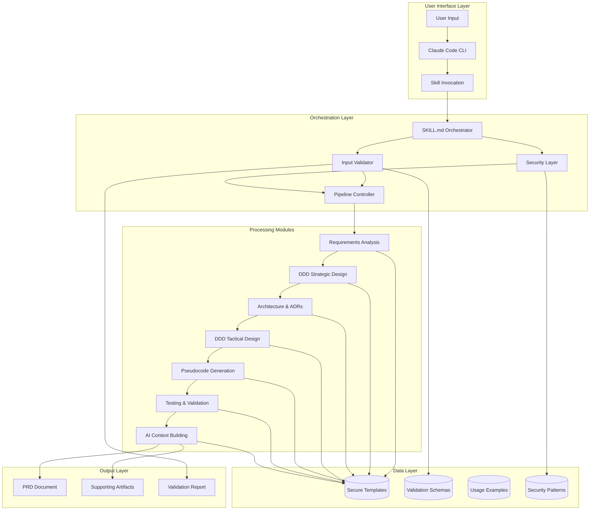
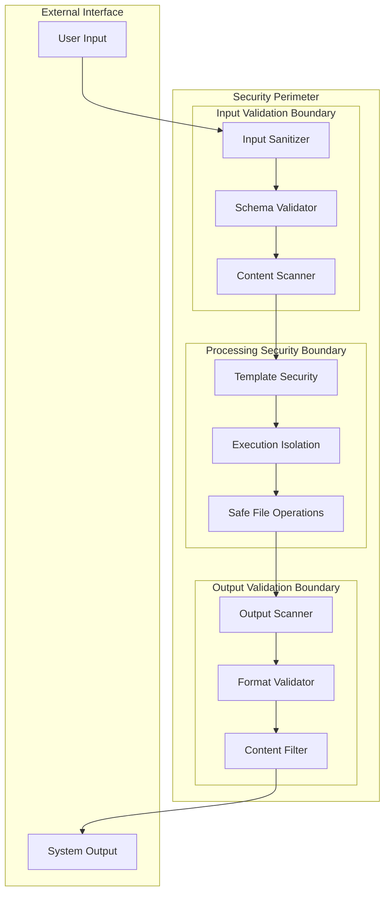
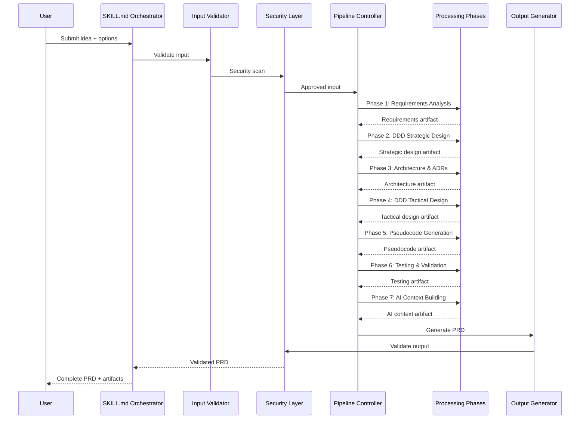
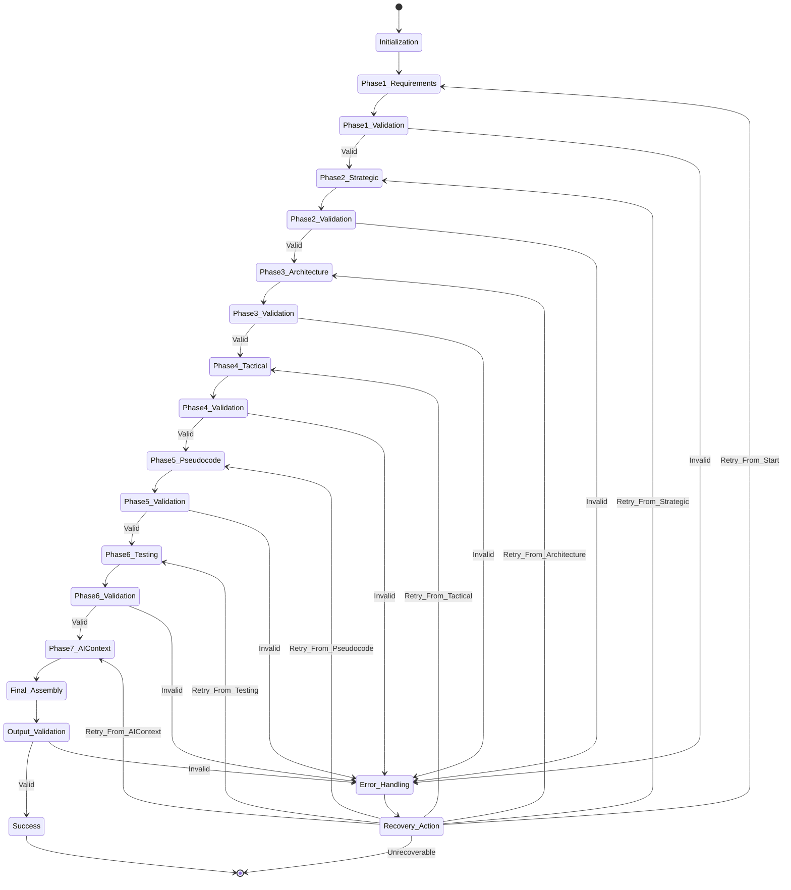

# SPARC Architecture: Secure Idea-to-PRD Claude Code Skill

## System Architecture Overview

The Secure Idea-to-PRD Claude Code Skill is designed as a modular, secure, and extensible system that transforms user ideas into comprehensive Product Requirements Documents (PRDs) through a validated pipeline architecture.

### High-Level System Architecture



## 1. Skill Structure Architecture

### Core Components

```yaml
skill_architecture:
  orchestrator:
    component: SKILL.md
    responsibilities:
      - "Skill lifecycle management"
      - "Pipeline orchestration"
      - "Error handling coordination"
      - "Security enforcement"

    interfaces:
      input:
        - user_idea: "Raw user input"
        - options: "Processing options"
        - constraints: "Security/validation constraints"

      output:
        - prd_document: "Complete PRD"
        - artifacts: "Supporting documents"
        - validation_report: "Security/quality report"

  modules:
    input_processor:
      location: "modules/input-processor.md"
      responsibilities:
        - "Input sanitization"
        - "Format validation"
        - "Content structure analysis"

      security_boundaries:
        - "XSS prevention"
        - "Injection attack prevention"
        - "File path validation"

    validation_framework:
      location: "modules/validation-framework.md"
      responsibilities:
        - "Schema validation"
        - "Business rule validation"
        - "Security policy enforcement"

      validation_layers:
        - syntax: "JSON/YAML schema validation"
        - semantic: "Business logic validation"
        - security: "Security policy compliance"

    pipeline_orchestrator:
      location: "modules/pipeline-orchestrator.md"
      responsibilities:
        - "Phase sequencing"
        - "State management"
        - "Error recovery"
        - "Progress tracking"

      state_management:
        - phase_state: "Current processing phase"
        - intermediate_outputs: "Phase artifacts"
        - error_context: "Error handling state"

    phase_implementations:
      location: "phases/"
      components:
        - "phase-01-requirements-analysis.md"
        - "phase-02-ddd-strategic-design.md"
        - "phase-03-architecture-adrs.md"
        - "phase-04-ddd-tactical-design.md"
        - "phase-05-pseudocode-generation.md"
        - "phase-06-testing-validation.md"
        - "phase-07-ai-context-building.md"

    output_generators:
      location: "modules/output-generators.md"
      responsibilities:
        - "PRD document assembly"
        - "Artifact packaging"
        - "Format conversion"
        - "Quality assurance"

    security_layer:
      location: "modules/security-layer.md"
      responsibilities:
        - "Input sanitization"
        - "Output validation"
        - "Template security"
        - "Execution isolation"
```

## 2. Security Architecture

### Security Boundaries and Controls



### Security Controls Implementation

```yaml
security_controls:
  input_validation:
    sanitization:
      - html_encoding: "Prevent XSS attacks"
      - sql_injection_prevention: "Parameterized queries only"
      - command_injection_prevention: "No shell execution of user input"
      - path_traversal_prevention: "Whitelist allowed paths"

    validation_rules:
      - max_input_size: "10MB"
      - allowed_file_types: [".md", ".json", ".yaml", ".txt"]
      - forbidden_patterns: ["<script>", "eval(", "exec("]
      - required_fields: ["idea", "context", "constraints"]

  template_security:
    template_isolation:
      - sandbox_execution: "Templates run in isolated environment"
      - no_system_access: "Templates cannot access system resources"
      - limited_file_access: "Read-only access to approved templates"

    template_validation:
      - syntax_checking: "Validate template syntax before use"
      - security_scanning: "Scan for malicious patterns"
      - version_control: "Track template changes"

  file_operations:
    safe_patterns:
      - absolute_paths_only: "No relative path operations"
      - whitelist_directories: "Only approved directories"
      - atomic_operations: "All-or-nothing file operations"
      - backup_before_modify: "Create backups before modifications"

    access_controls:
      - read_only_templates: "Templates are read-only"
      - write_protected_system: "System files are protected"
      - temporary_file_cleanup: "Clean up temporary files"

  execution_security:
    isolation:
      - process_isolation: "Each phase runs in isolation"
      - memory_limits: "Bounded memory usage"
      - timeout_protection: "Prevent infinite loops"
      - resource_monitoring: "Monitor resource usage"

    error_handling:
      - secure_error_messages: "No sensitive data in errors"
      - logging_security: "Secure logging practices"
      - graceful_degradation: "Fail safely"
```

## 3. Data Flow Architecture

### Processing Pipeline Flow



### Data Transformation Flow

```yaml
data_flow:
  stage_1_input:
    format: "Raw user input"
    structure:
      - idea: "Free-form text description"
      - context: "Business/technical context"
      - constraints: "Limitations and requirements"
      - preferences: "User preferences"

    validation:
      - format_check: "Ensure required fields present"
      - size_limits: "Enforce input size limits"
      - content_scan: "Security content scanning"

  stage_2_structured:
    format: "Structured requirements"
    structure:
      - functional_requirements: "What the system should do"
      - non_functional_requirements: "Quality attributes"
      - business_context: "Business drivers and constraints"
      - stakeholders: "Key stakeholders and their needs"

    transformation: "NLP extraction and structuring"

  stage_3_strategic_design:
    format: "Domain model"
    structure:
      - bounded_contexts: "Strategic domain boundaries"
      - ubiquitous_language: "Domain vocabulary"
      - context_map: "Context relationships"
      - strategic_patterns: "Applied strategic patterns"

    transformation: "DDD strategic analysis"

  stage_4_architecture:
    format: "System architecture"
    structure:
      - system_components: "Major system components"
      - interfaces: "Component interfaces"
      - deployment_view: "Deployment architecture"
      - quality_attributes: "Non-functional requirements"

    transformation: "Architectural design process"

  stage_5_tactical_design:
    format: "Implementation model"
    structure:
      - aggregates: "Domain aggregates"
      - entities: "Domain entities"
      - value_objects: "Value objects"
      - domain_services: "Domain services"
      - repositories: "Data access patterns"

    transformation: "DDD tactical modeling"

  stage_6_pseudocode:
    format: "Implementation pseudocode"
    structure:
      - algorithms: "Core algorithms"
      - data_structures: "Data organization"
      - interfaces: "API specifications"
      - workflows: "Process flows"

    transformation: "Technical specification generation"

  stage_7_testing:
    format: "Test specifications"
    structure:
      - test_scenarios: "Test cases"
      - acceptance_criteria: "Acceptance tests"
      - quality_metrics: "Quality measurements"
      - validation_rules: "Validation criteria"

    transformation: "Test planning and validation"

  stage_8_prd:
    format: "Complete PRD document"
    structure:
      - executive_summary: "High-level overview"
      - requirements: "Detailed requirements"
      - architecture: "System design"
      - implementation_plan: "Development roadmap"
      - testing_strategy: "Quality assurance plan"
      - appendices: "Supporting documentation"

    transformation: "Document assembly and formatting"
```

## 4. File Organization Architecture

### Directory Structure

```
/workspaces/jlmaworkspace/new_projects/claude-skill-idea_to_PRD/
├── SKILL.md                           # Main orchestrator
├── README.md                          # Skill documentation
├── architecture.md                    # This architecture document
├──
├── modules/                           # Core processing modules
│   ├── input-processor.md
│   ├── validation-framework.md
│   ├── pipeline-orchestrator.md
│   ├── output-generators.md
│   └── security-layer.md
├──
├── phases/                           # Processing phase implementations
│   ├── phase-01-requirements-analysis.md
│   ├── phase-02-ddd-strategic-design.md
│   ├── phase-03-architecture-adrs.md
│   ├── phase-04-ddd-tactical-design.md
│   ├── phase-05-pseudocode-generation.md
│   ├── phase-06-testing-validation.md
│   └── phase-07-ai-context-building.md
├──
├── templates/                        # Secure document templates
│   ├── prd-template.md
│   ├── requirements-template.md
│   ├── architecture-template.md
│   ├── ddd-strategic-template.md
│   ├── ddd-tactical-template.md
│   ├── pseudocode-template.md
│   └── testing-template.md
├──
├── schemas/                          # Validation schemas
│   ├── input-schema.json
│   ├── requirements-schema.json
│   ├── architecture-schema.json
│   ├── ddd-schema.json
│   └── output-schema.json
├──
├── security/                         # Security patterns and policies
│   ├── input-validation.md
│   ├── template-security.md
│   ├── file-operation-policies.md
│   └── error-handling-patterns.md
├──
└── examples/                         # Usage examples and test cases
    ├── simple-web-app.md
    ├── microservice-api.md
    ├── data-pipeline.md
    └── mobile-app.md
```

### File Access Patterns

```yaml
file_access_patterns:
  read_only_files:
    - "templates/*.md"
    - "schemas/*.json"
    - "security/*.md"
    - "examples/*.md"

  write_protected_files:
    - "SKILL.md"
    - "modules/*.md"
    - "phases/*.md"

  temporary_files:
    location: "/tmp/claude-skill-prd/"
    cleanup_policy: "Delete after processing"
    max_size: "100MB"
    max_age: "1 hour"

  output_files:
    location: "User-specified or /tmp/"
    naming_convention: "prd-{timestamp}-{hash}.md"
    backup_policy: "Create backup if exists"
```

## 5. Phase Pipeline Architecture

### Phase Orchestration



### Phase Implementation Details

```yaml
phase_pipeline:
  phase_1_requirements_analysis:
    purpose: "Extract and structure requirements from user input"
    inputs:
      - raw_user_idea: "Free-form description"
      - context_information: "Business/technical context"

    processing_steps:
      - nlp_extraction: "Extract key concepts and requirements"
      - requirement_classification: "Categorize functional/non-functional"
      - stakeholder_identification: "Identify key stakeholders"
      - constraint_analysis: "Analyze limitations and constraints"

    outputs:
      - structured_requirements: "Organized requirements document"
      - stakeholder_map: "Stakeholder needs mapping"
      - constraint_matrix: "Constraint analysis"

    validation_criteria:
      - completeness: "All required fields populated"
      - consistency: "No conflicting requirements"
      - feasibility: "Requirements are achievable"

    templates:
      - requirements_template: "Standard requirements format"
      - stakeholder_template: "Stakeholder analysis format"

  phase_2_ddd_strategic_design:
    purpose: "Apply Domain-Driven Design strategic patterns"
    inputs:
      - structured_requirements: "From Phase 1"
      - domain_context: "Business domain information"

    processing_steps:
      - domain_modeling: "Create initial domain model"
      - bounded_context_identification: "Define context boundaries"
      - ubiquitous_language: "Define domain vocabulary"
      - context_mapping: "Map context relationships"

    outputs:
      - domain_model: "Strategic domain model"
      - bounded_contexts: "Context definitions"
      - context_map: "Context relationship map"
      - ubiquitous_language_glossary: "Domain vocabulary"

    validation_criteria:
      - context_clarity: "Clear bounded context definitions"
      - language_consistency: "Consistent terminology usage"
      - relationship_validity: "Valid context relationships"

  phase_3_architecture_adrs:
    purpose: "Design system architecture and document decisions"
    inputs:
      - domain_model: "From Phase 2"
      - non_functional_requirements: "Quality attributes"

    processing_steps:
      - architectural_decision_making: "Make key architecture decisions"
      - component_design: "Design system components"
      - interface_specification: "Define component interfaces"
      - adr_documentation: "Document architectural decisions"

    outputs:
      - system_architecture: "Complete system design"
      - component_specifications: "Detailed component designs"
      - architecture_decision_records: "ADR documentation"
      - deployment_architecture: "Deployment design"

    validation_criteria:
      - architectural_consistency: "Consistent design decisions"
      - quality_attribute_satisfaction: "Meets non-functional requirements"
      - component_cohesion: "Well-defined component boundaries"

  phase_4_ddd_tactical_design:
    purpose: "Apply DDD tactical patterns for implementation"
    inputs:
      - system_architecture: "From Phase 3"
      - bounded_contexts: "From Phase 2"

    processing_steps:
      - aggregate_design: "Design domain aggregates"
      - entity_modeling: "Model domain entities"
      - value_object_identification: "Identify value objects"
      - service_design: "Design domain services"
      - repository_patterns: "Design data access patterns"

    outputs:
      - tactical_design_model: "Implementation-ready domain model"
      - aggregate_specifications: "Aggregate definitions"
      - entity_definitions: "Entity specifications"
      - service_contracts: "Service interfaces"

    validation_criteria:
      - aggregate_consistency: "Proper aggregate boundaries"
      - invariant_preservation: "Business rules maintained"
      - persistence_patterns: "Appropriate data patterns"

  phase_5_pseudocode_generation:
    purpose: "Generate implementation pseudocode"
    inputs:
      - tactical_design_model: "From Phase 4"
      - system_architecture: "From Phase 3"

    processing_steps:
      - algorithm_specification: "Specify core algorithms"
      - data_structure_design: "Design data structures"
      - api_specification: "Define API contracts"
      - workflow_modeling: "Model business workflows"

    outputs:
      - implementation_pseudocode: "Detailed pseudocode"
      - api_specifications: "API contract definitions"
      - data_models: "Data structure specifications"
      - algorithm_descriptions: "Algorithm implementations"

    validation_criteria:
      - algorithmic_correctness: "Algorithms solve the problems"
      - api_completeness: "All required APIs specified"
      - data_consistency: "Consistent data modeling"

  phase_6_testing_validation:
    purpose: "Define testing strategy and validation criteria"
    inputs:
      - implementation_pseudocode: "From Phase 5"
      - structured_requirements: "From Phase 1"

    processing_steps:
      - test_case_generation: "Generate comprehensive test cases"
      - acceptance_criteria_definition: "Define acceptance tests"
      - quality_metrics_specification: "Specify quality measurements"
      - validation_strategy: "Define validation approach"

    outputs:
      - test_specifications: "Comprehensive test plans"
      - acceptance_criteria: "Acceptance test definitions"
      - quality_metrics: "Quality measurement criteria"
      - validation_checklist: "Validation procedures"

    validation_criteria:
      - test_coverage: "Adequate test coverage"
      - acceptance_completeness: "All requirements covered"
      - measurable_criteria: "Quantifiable quality metrics"

  phase_7_ai_context_building:
    purpose: "Build comprehensive AI context and assemble final PRD"
    inputs:
      - all_previous_phases: "All generated artifacts"
      - original_requirements: "Original user input"

    processing_steps:
      - context_synthesis: "Synthesize all information"
      - document_assembly: "Assemble complete PRD"
      - cross_reference_validation: "Ensure consistency across phases"
      - final_quality_check: "Final quality assurance"

    outputs:
      - complete_prd_document: "Final PRD document"
      - supporting_artifacts: "All phase outputs"
      - traceability_matrix: "Requirements traceability"
      - ai_context_summary: "AI implementation context"

    validation_criteria:
      - document_completeness: "All required sections present"
      - consistency_across_phases: "Consistent information"
      - implementation_readiness: "Ready for development"
```

## 6. Component Interaction Patterns

### Inter-Component Communication

```yaml
communication_patterns:
  orchestrator_to_modules:
    pattern: "Command/Response"
    security: "Validated parameters only"
    error_handling: "Graceful degradation"

    example:
      command: "process_phase"
      parameters:
        phase_id: "phase_01"
        input_data: "validated_requirements"
        options: "processing_options"

      response:
        status: "success|failure|warning"
        output_data: "phase_results"
        metadata: "processing_metadata"
        errors: "error_descriptions"

  module_to_template:
    pattern: "Template Resolution"
    security: "Read-only access"
    caching: "Template caching enabled"

    example:
      request: "resolve_template"
      parameters:
        template_name: "requirements-template.md"
        template_vars: "variable_substitutions"

      response:
        resolved_template: "processed_template_content"
        used_variables: "variable_list"

  validator_interactions:
    pattern: "Validation Pipeline"
    security: "Fail-secure validation"
    logging: "Comprehensive audit trail"

    validation_chain:
      - syntax_validation: "Schema compliance"
      - semantic_validation: "Business rule compliance"
      - security_validation: "Security policy compliance"
      - quality_validation: "Quality standard compliance"
```

### Error Handling Architecture

```yaml
error_handling:
  error_categories:
    input_errors:
      - invalid_format: "Input format violations"
      - missing_required_fields: "Required field omissions"
      - security_violations: "Security policy violations"
      - size_limit_exceeded: "Input size limit violations"

    processing_errors:
      - template_resolution_failure: "Template processing errors"
      - validation_failure: "Validation rule violations"
      - resource_exhaustion: "System resource limitations"
      - timeout_errors: "Processing timeout violations"

    system_errors:
      - file_access_denied: "File system access errors"
      - memory_allocation_failure: "Memory allocation errors"
      - network_connectivity: "Network-related errors"
      - configuration_errors: "System configuration issues"

  error_recovery_strategies:
    graceful_degradation:
      - partial_processing: "Process available inputs"
      - fallback_templates: "Use simpler templates"
      - reduced_functionality: "Provide core functionality"

    retry_mechanisms:
      - exponential_backoff: "Retry with increasing delays"
      - circuit_breaker: "Prevent cascading failures"
      - retry_limits: "Maximum retry attempts"

    user_communication:
      - clear_error_messages: "User-friendly error descriptions"
      - suggested_actions: "Actionable recovery suggestions"
      - progress_preservation: "Maintain completed work"
```

## 7. Performance and Scalability Architecture

### Performance Optimization Strategies

```yaml
performance_architecture:
  processing_optimization:
    parallel_processing:
      - phase_parallelization: "Independent phases run concurrently"
      - template_caching: "Cache frequently used templates"
      - validation_optimization: "Optimized validation pipelines"

    resource_management:
      - memory_pooling: "Efficient memory allocation"
      - streaming_processing: "Stream large inputs"
      - lazy_loading: "Load resources on demand"

    caching_strategies:
      - template_cache: "Cache compiled templates"
      - validation_cache: "Cache validation results"
      - intermediate_cache: "Cache phase outputs"

  scalability_patterns:
    horizontal_scaling:
      - stateless_design: "Stateless processing modules"
      - load_balancing: "Distribute processing load"
      - micro_batch_processing: "Process in small batches"

    vertical_scaling:
      - resource_limits: "Configurable resource limits"
      - adaptive_processing: "Adjust processing based on load"
      - priority_queuing: "Priority-based processing"
```

## 8. Security Implementation Details

### Security Layer Implementation

```yaml
security_implementation:
  input_security:
    sanitization_rules:
      - html_encoding: "Encode HTML special characters"
      - script_removal: "Remove script tags and inline scripts"
      - path_normalization: "Normalize file paths"
      - size_validation: "Enforce input size limits"

    validation_pipeline:
      - format_validation: "Validate input format"
      - schema_compliance: "Check against schemas"
      - business_rule_validation: "Validate business rules"
      - security_policy_validation: "Check security policies"

  template_security:
    template_sandboxing:
      - isolated_execution: "Execute templates in sandbox"
      - limited_api_access: "Restrict API access"
      - resource_constraints: "Limit resource usage"
      - timeout_protection: "Prevent infinite loops"

    template_validation:
      - syntax_checking: "Validate template syntax"
      - security_scanning: "Scan for malicious patterns"
      - dependency_validation: "Validate template dependencies"

  file_security:
    access_controls:
      - path_whitelisting: "Allow only approved paths"
      - permission_checking: "Verify file permissions"
      - atomic_operations: "Use atomic file operations"
      - backup_creation: "Create backups before modification"

    content_validation:
      - malware_scanning: "Scan file contents"
      - format_validation: "Validate file formats"
      - size_limiting: "Enforce file size limits"
```

## 9. Quality Assurance Architecture

### Quality Gates and Metrics

```yaml
quality_architecture:
  quality_gates:
    input_quality:
      - completeness_check: "All required inputs present"
      - consistency_validation: "No conflicting inputs"
      - clarity_assessment: "Input clarity score > 0.8"

    processing_quality:
      - phase_validation: "Each phase meets quality criteria"
      - consistency_checking: "Cross-phase consistency"
      - completeness_verification: "All outputs generated"

    output_quality:
      - document_completeness: "All required sections present"
      - format_validation: "Proper document formatting"
      - content_quality: "Content quality score > 0.85"
      - traceability_verification: "Requirements traceability"

  quality_metrics:
    processing_metrics:
      - phase_completion_rate: "Percentage of successful phases"
      - validation_pass_rate: "Percentage of validation passes"
      - error_recovery_rate: "Percentage of successful recoveries"

    output_metrics:
      - document_quality_score: "Composite quality score"
      - requirements_coverage: "Percentage of requirements covered"
      - consistency_score: "Cross-phase consistency measure"
      - implementation_readiness: "Readiness for development"
```

## 10. Monitoring and Observability Architecture

### System Monitoring

```yaml
monitoring_architecture:
  performance_monitoring:
    metrics:
      - processing_time_per_phase: "Phase execution duration"
      - memory_usage_patterns: "Memory consumption tracking"
      - error_rates: "Error frequency and types"
      - resource_utilization: "CPU/memory/disk usage"

    alerting:
      - performance_degradation: "Alert on slow processing"
      - error_rate_increase: "Alert on error spikes"
      - resource_exhaustion: "Alert on resource limits"

  audit_logging:
    log_categories:
      - security_events: "Security-related activities"
      - processing_events: "Phase processing activities"
      - error_events: "Error occurrences and recovery"
      - user_interactions: "User input and outputs"

    log_retention:
      - security_logs: "Retain for 1 year"
      - processing_logs: "Retain for 30 days"
      - error_logs: "Retain for 90 days"
```

This comprehensive architecture document provides the foundation for implementing the Secure Idea-to-PRD Claude Code Skill. The modular, secure, and extensible design ensures robust processing of user ideas into comprehensive PRDs while maintaining security, quality, and performance standards.

The architecture emphasizes:
- **Security First**: Multiple security boundaries and validation layers
- **Modular Design**: Loosely coupled, highly cohesive components
- **Quality Assurance**: Comprehensive validation and quality gates
- **Error Resilience**: Robust error handling and recovery mechanisms
- **Performance**: Optimized processing and resource management
- **Observability**: Comprehensive monitoring and logging

The next phase will involve implementing these architectural components according to the SPARC methodology's Code phase.