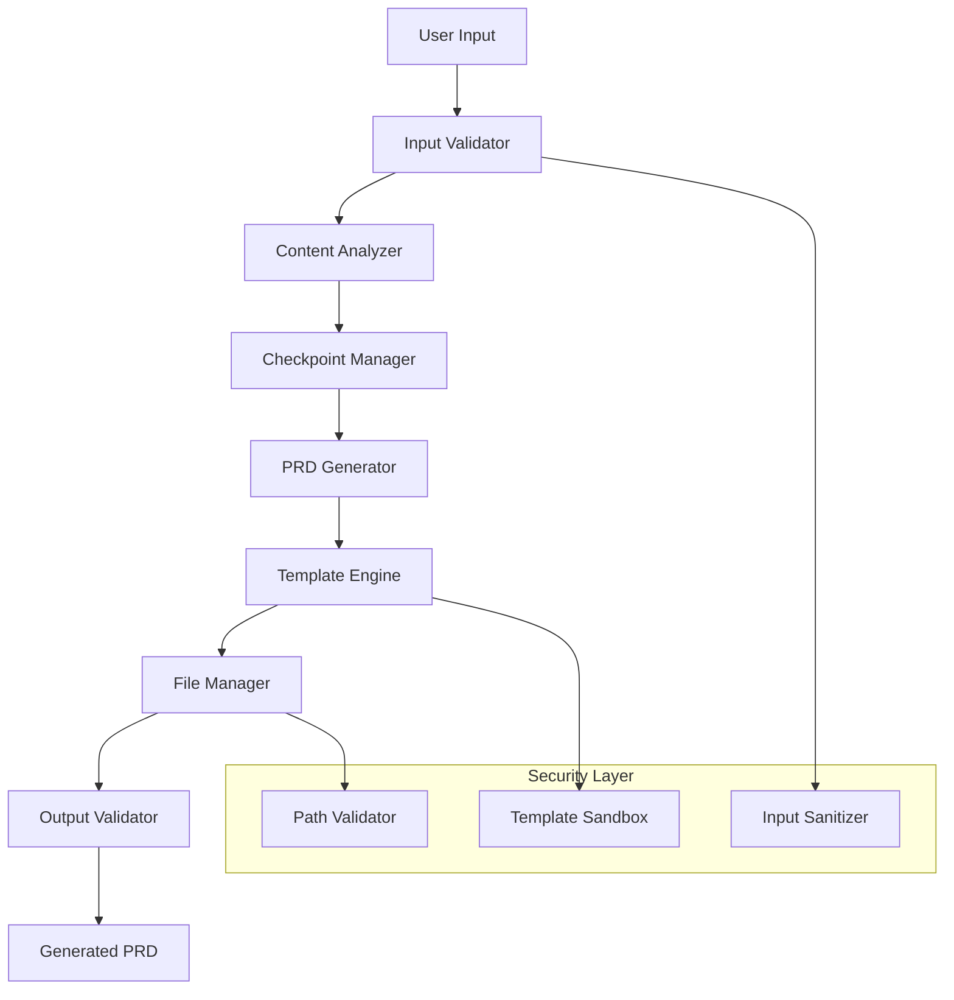

# Specification Document: Secure Idea-to-PRD Claude Code Skill

**Document Version**: 1.0
**Date**: 2026-02-11
**SPARC Phase**: Specification
**Project**: Claude Code Skill for Idea-to-PRD Generation

## 1. Executive Summary

### 1.1 Purpose
This specification defines requirements for a secure Claude Code skill that transforms user ideas and problems into comprehensive Product Requirements Documents (PRDs) with Domain-Driven Design (DDD) architecture. The skill provides a structured, checkpoint-based approach to guide users through progressive disclosure while maintaining security and quality standards.

### 1.2 Scope
- Input processing and validation for user ideas/problems
- Progressive PRD generation with checkpoint confirmations
- DDD architecture documentation generation
- Security-hardened file operations and content filtering
- Integration with Claude Code ecosystem and tools
- Template-based output with customizable structures

### 1.3 Success Criteria
- Generate production-ready PRDs within 15-20 minutes
- Achieve 95% user satisfaction with checkpoint clarity
- Maintain zero security vulnerabilities in file operations
- Support 100+ concurrent skill executions
- Integrate seamlessly with existing Claude Code workflows

## 2. Functional Requirements

### 2.1 Input Processing (FR-001 to FR-006)

#### FR-001: Idea Input Validation
**Priority**: High
**Description**: System shall accept and validate user problem/idea inputs with comprehensive sanitization.

**Acceptance Criteria**:
- Accept text input up to 10,000 characters
- Validate input against malicious content patterns
- Sanitize HTML/script injection attempts
- Support markdown formatting in input
- Preserve user intent while removing threats
- Return clear validation error messages

**Edge Cases**:
- Empty or whitespace-only input
- Extremely long input (>10KB)
- Non-UTF8 character encoding
- Mixed content types (text + binary)

#### FR-002: Content Analysis Pipeline
**Priority**: High
**Description**: System shall analyze input to extract key requirements, goals, and constraints.

**Acceptance Criteria**:
- Identify core problem statement with 90% accuracy
- Extract functional requirements from natural language
- Detect technical constraints and preferences
- Classify project complexity (simple/moderate/complex)
- Generate initial scope boundaries
- Create preliminary user personas

#### FR-003: Progressive Disclosure Management
**Priority**: High
**Description**: System shall guide users through structured phases with clear checkpoints.

**Acceptance Criteria**:
- Present maximum 3 questions per checkpoint
- Provide clear progress indicators (1/5, 2/5, etc.)
- Allow users to revise previous answers
- Maintain session state across checkpoints
- Support checkpoint skipping with defaults
- Generate summary at each phase completion

### 2.2 PRD Generation (FR-007 to FR-012)

#### FR-007: Core PRD Structure Generation
**Priority**: High
**Description**: System shall generate comprehensive PRD documents following industry standards.

**Acceptance Criteria**:
- Include all standard PRD sections (Executive Summary, Goals, Requirements, etc.)
- Generate 5-15 pages of detailed content
- Maintain consistent formatting and style
- Include cross-references and dependencies
- Support multiple output formats (Markdown, PDF export ready)
- Embed metadata for version control

**PRD Structure Requirements**:
```yaml
sections:
  - executive_summary
  - problem_statement
  - goals_and_objectives
  - user_personas
  - functional_requirements
  - non_functional_requirements
  - technical_specifications
  - architecture_overview
  - implementation_timeline
  - success_metrics
  - risk_assessment
  - appendices
```

#### FR-008: DDD Architecture Documentation
**Priority**: High
**Description**: System shall generate Domain-Driven Design documentation with bounded contexts.

**Acceptance Criteria**:
- Identify 3-7 bounded contexts per domain
- Generate domain models with entities and aggregates
- Create context maps showing relationships
- Define ubiquitous language glossary
- Document integration patterns between contexts
- Include strategic design patterns

#### FR-009: Technical Specifications
**Priority**: Medium
**Description**: System shall generate detailed technical requirements and constraints.

**Acceptance Criteria**:
- Define API specifications with OpenAPI 3.0 format
- Specify database schemas and relationships
- Document infrastructure requirements
- Include performance benchmarks and SLAs
- Define security requirements and compliance needs
- Generate deployment and operational requirements

### 2.3 File Operations (FR-013 to FR-018)

#### FR-013: Secure File Generation
**Priority**: Critical
**Description**: System shall create files with path traversal protection and safe naming.

**Acceptance Criteria**:
- Validate all file paths against directory traversal
- Sanitize filenames to remove dangerous characters
- Enforce file size limits (max 5MB per file)
- Use atomic file operations to prevent corruption
- Maintain file permissions according to system policy
- Log all file operations for audit trail

**Security Validation Rules**:
- Block paths containing `../`, `./`, or absolute paths outside project directory
- Restrict filename characters to `[a-zA-Z0-9._-]`
- Prevent overwriting system or hidden files
- Validate file extensions against allowlist

#### FR-014: Template System
**Priority**: Medium
**Description**: System shall use secure template rendering with injection protection.

**Acceptance Criteria**:
- Support Handlebars-style template syntax
- Escape all user input in templates
- Validate template structure before rendering
- Support conditional blocks and iterations
- Provide template inheritance and partials
- Cache compiled templates for performance

### 2.4 Integration Requirements (FR-019 to FR-024)

#### FR-019: Claude Code Skill Format
**Priority**: High
**Description**: System shall conform to Claude Code skill specification format.

**Acceptance Criteria**:
- Include valid YAML frontmatter with required fields
- Support skill versioning and dependencies
- Integrate with Claude Code tool ecosystem
- Provide clear skill description and usage examples
- Include proper error handling and recovery
- Support skill composition and chaining

**Required YAML Frontmatter**:
```yaml
name: idea-to-prd
version: "1.0.0"
description: "Transform ideas into comprehensive PRDs with DDD architecture"
author: "Claude Flow Team"
category: "documentation"
tags: ["prd", "ddd", "architecture", "planning"]
dependencies:
  - "@claude-flow/cli"
inputs:
  - name: "idea"
    type: "text"
    required: true
    validation: "max-length:10000"
outputs:
  - name: "prd"
    type: "file"
    format: "markdown"
```

#### FR-020: Tool Integration
**Priority**: Medium
**Description**: System shall integrate with Claude Code's built-in tools (Read, Write, Edit, Glob, etc.).

**Acceptance Criteria**:
- Use Read tool for template loading
- Use Write tool for file generation
- Use Edit tool for iterative improvements
- Use Glob tool for file discovery
- Handle tool errors gracefully
- Maintain tool call efficiency (<5 calls per operation)

## 3. Non-Functional Requirements

### 3.1 Security Requirements (NFR-001 to NFR-008)

#### NFR-001: Input Sanitization
**Category**: Security
**Priority**: Critical
**Description**: All user inputs shall be sanitized against injection attacks.

**Measurement**: Zero successful injection attempts in penetration testing
**Validation**: Regular security scans and code reviews

**Security Controls**:
- HTML entity encoding for all user input
- SQL injection protection (parameterized queries)
- Script injection prevention
- Path traversal protection
- File upload validation
- Content Security Policy headers

#### NFR-002: Template Security
**Category**: Security
**Priority**: Critical
**Description**: Template rendering shall prevent server-side template injection.

**Measurement**: Zero template injection vulnerabilities
**Validation**: Static analysis tools and security audits

**Protection Mechanisms**:
- Sandboxed template execution environment
- Restricted template function access
- Input validation before template rendering
- Output encoding after template processing

#### NFR-003: File System Security
**Category**: Security
**Priority**: Critical
**Description**: File operations shall be restricted to designated project directories.

**Measurement**: 100% path validation success rate
**Validation**: Automated testing with malicious path attempts

### 3.2 Performance Requirements (NFR-009 to NFR-012)

#### NFR-009: Response Time
**Category**: Performance
**Priority**: High
**Description**: Skill execution shall complete within acceptable time limits.

**Performance Targets**:
- Initial analysis: <30 seconds
- Checkpoint processing: <15 seconds
- PRD generation: <2 minutes
- File writing: <5 seconds
- Total skill execution: <15 minutes

**Measurement**: 95th percentile response times

#### NFR-010: Concurrency Support
**Category**: Performance
**Priority**: Medium
**Description**: System shall support multiple concurrent skill executions.

**Measurement**: Support 100+ concurrent users with <10% performance degradation
**Validation**: Load testing with simulated concurrent users

#### NFR-011: Memory Efficiency
**Category**: Performance
**Priority**: Medium
**Description**: Skill shall operate within memory constraints.

**Measurement**: Maximum 512MB memory usage per skill instance
**Validation**: Memory profiling during execution

### 3.3 Reliability Requirements (NFR-013 to NFR-016)

#### NFR-013: Error Recovery
**Category**: Reliability
**Priority**: High
**Description**: System shall gracefully handle and recover from errors.

**Recovery Mechanisms**:
- Checkpoint restoration on failure
- Partial progress preservation
- Clear error messages with recovery steps
- Automatic retry for transient failures
- Manual intervention points for complex errors

#### NFR-014: Data Integrity
**Category**: Reliability
**Priority**: High
**Description**: Generated documents shall maintain consistency and completeness.

**Validation Methods**:
- Schema validation for all generated content
- Cross-reference verification within documents
- Completeness checks against requirements
- Format validation for output files

### 3.4 Usability Requirements (NFR-017 to NFR-020)

#### NFR-017: User Experience
**Category**: Usability
**Priority**: High
**Description**: Interface shall provide clear guidance and feedback throughout the process.

**UX Requirements**:
- Progress indicators show completion percentage
- Clear instructions at each checkpoint
- Helpful examples and guidance text
- Validation feedback in real-time
- Option to preview before final generation

#### NFR-018: Accessibility
**Category**: Usability
**Priority**: Medium
**Description**: Generated content shall follow accessibility guidelines.

**Accessibility Standards**:
- WCAG 2.1 AA compliance for generated HTML
- Semantic markup in output documents
- Alt text for generated diagrams
- Logical reading order in documents

## 4. Technical Specifications

### 4.1 Architecture Overview

#### 4.1.1 System Components



#### 4.1.2 Data Flow

```yaml
data_flow:
  1_input_processing:
    input: "Raw user idea/problem text"
    processing: "Sanitization → Validation → Analysis"
    output: "Structured requirement objects"

  2_checkpoint_management:
    input: "Structured requirements + user responses"
    processing: "Progressive disclosure → State management"
    output: "Complete requirement specification"

  3_content_generation:
    input: "Complete requirements"
    processing: "Template rendering → Content generation"
    output: "PRD sections + DDD documentation"

  4_file_operations:
    input: "Generated content"
    processing: "Security validation → File writing"
    output: "Complete project documentation"
```

### 4.2 File Structure Specification

#### 4.2.1 Output Directory Structure

```
project_name/
├── README.md                    # Project overview
├── PRD.md                      # Main Product Requirements Document
├── architecture/
│   ├── overview.md             # System architecture overview
│   ├── bounded-contexts.md     # DDD bounded contexts
│   ├── domain-models.md        # Domain model definitions
│   └── c4-diagrams/           # C4 architecture diagrams
│       ├── context.md         # System context
│       ├── container.md       # Container diagram
│       ├── component.md       # Component diagram
│       └── code.md            # Code structure
├── requirements/
│   ├── functional.md          # Functional requirements
│   ├── non-functional.md      # Non-functional requirements
│   └── acceptance-criteria.md # Detailed acceptance criteria
├── technical/
│   ├── api-specifications.md  # API documentation
│   ├── database-schema.md     # Data model specifications
│   └── infrastructure.md      # Infrastructure requirements
├── planning/
│   ├── timeline.md            # Implementation timeline
│   ├── milestones.md          # Project milestones
│   └── risks.md               # Risk assessment
└── ai-context/
    ├── domain-knowledge.md    # Domain-specific knowledge
    ├── decision-log.md        # Architectural decisions
    └── constraints.md         # System constraints
```

#### 4.2.2 File Naming Conventions

```yaml
naming_conventions:
  general: "kebab-case for all files and directories"
  markdown: ".md extension for all documentation"
  diagrams: "descriptive names with diagram type"

validation_rules:
  filename_pattern: "^[a-z0-9-]+\\.[a-z]+$"
  directory_pattern: "^[a-z0-9-]+$"
  max_filename_length: 100
  reserved_names: ["con", "aux", "prn", "nul"]
```

### 4.3 Template Specifications

#### 4.3.1 Template Structure

```yaml
template_engine:
  syntax: "handlebars-like"
  features:
    - variable_substitution
    - conditional_blocks
    - iteration_loops
    - partial_includes
    - helper_functions

security:
  sandbox: true
  allowed_functions:
    - "if", "unless", "each", "with"
    - "eq", "ne", "lt", "gt", "and", "or"
    - "capitalize", "lowercase", "format_date"
  blocked_functions:
    - "eval", "exec", "require"
    - file system access
    - network operations
```

#### 4.3.2 PRD Template Structure

```handlebars
# {{project_name}} - Product Requirements Document

## Executive Summary
{{#if executive_summary}}
{{executive_summary}}
{{else}}
*Generated based on analyzed requirements*
{{/if}}

## Problem Statement
{{problem_statement}}

## Goals and Objectives
{{#each goals}}
- **{{this.title}}**: {{this.description}}
{{/each}}

## User Personas
{{#each personas}}
### {{this.name}}
- **Role**: {{this.role}}
- **Goals**: {{#each this.goals}}{{this}}{{#unless @last}}, {{/unless}}{{/each}}
- **Pain Points**: {{#each this.pain_points}}{{this}}{{#unless @last}}, {{/unless}}{{/each}}
{{/each}}

{{> functional_requirements}}
{{> technical_specifications}}
{{> implementation_timeline}}
```

## 5. Use Cases and Scenarios

### 5.1 Primary Use Cases

#### UC-001: Simple Web Application PRD
**Actor**: Product Manager
**Goal**: Create PRD for basic CRUD web application

**Preconditions**:
- User has basic product idea
- Claude Code environment is available

**Main Flow**:
1. User inputs idea: "Task management app for small teams"
2. System analyzes input and identifies key concepts
3. System guides user through 5 checkpoints:
   - Target audience and user needs
   - Core features and functionality
   - Technical preferences and constraints
   - Integration requirements
   - Success metrics and timeline
4. System generates comprehensive PRD with DDD architecture
5. User reviews and approves final documentation

**Postconditions**:
- Complete PRD document generated
- DDD documentation with bounded contexts created
- Technical specifications documented
- Project structure established

**Success Scenario Extensions**:
- User requests modifications at any checkpoint
- System adapts subsequent questions based on responses
- Generated PRD includes implementation timeline

**Exception Flows**:
- **E1**: User provides insufficient detail
  - System prompts for clarification with examples
  - Offers to proceed with reasonable defaults
- **E2**: Technical constraints conflict
  - System highlights conflicts and suggests resolutions
  - Allows user to prioritize constraints

#### UC-002: Enterprise System PRD
**Actor**: Technical Architect
**Goal**: Create comprehensive PRD for complex enterprise system

**Preconditions**:
- User has detailed system requirements
- Enterprise context and constraints defined

**Main Flow**:
1. User inputs complex idea: "Multi-tenant SaaS platform for healthcare data"
2. System detects complexity and adjusts checkpoint depth
3. Extended checkpoint flow (7-10 checkpoints):
   - Business context and market analysis
   - Regulatory and compliance requirements
   - Security and privacy requirements
   - Scalability and performance needs
   - Integration with existing systems
   - Data architecture and modeling
   - Deployment and operational requirements
4. System generates enterprise-grade PRD with:
   - Detailed security specifications
   - Compliance mapping
   - Complex DDD architecture with multiple bounded contexts
   - Integration patterns and API specifications

**Success Metrics**:
- PRD completeness score >90%
- All compliance requirements documented
- Security controls specified
- Performance benchmarks defined

#### UC-003: API Service PRD
**Actor**: Backend Developer
**Goal**: Create PRD for microservice or API

**Main Flow**:
1. User inputs: "REST API for user authentication and authorization"
2. System focuses on API-specific checkpoints:
   - API contract and endpoints
   - Data models and validation
   - Authentication and security
   - Error handling and responses
   - Documentation and testing
3. System generates API-focused PRD with:
   - OpenAPI 3.0 specification
   - Detailed endpoint documentation
   - Security implementation guide
   - Testing and validation requirements

### 5.2 Edge Cases and Error Scenarios

#### EC-001: Malicious Input Handling
**Scenario**: User attempts script injection in idea description
**Input**: `"<script>alert('xss')</script>User management system"`
**Expected Behavior**:
- System sanitizes input: "User management system"
- Logs security attempt for monitoring
- Continues with clean input processing
- Provides warning about input cleaning

#### EC-002: Extremely Large Input
**Scenario**: User provides 50,000+ character description
**Expected Behavior**:
- System truncates to first 10,000 characters
- Notifies user of truncation
- Suggests breaking into multiple skills or phases
- Offers to save full input for reference

#### EC-003: Network Interruption During Generation
**Scenario**: Network fails during PRD generation phase
**Expected Behavior**:
- System saves current progress to checkpoint
- Provides recovery instructions
- Allows resumption from last completed section
- Maintains all user inputs and configurations

#### EC-004: Invalid Project Name
**Scenario**: User wants project named "../../etc/passwd"
**Expected Behavior**:
- System rejects invalid characters
- Suggests sanitized alternative: "etc-passwd"
- Explains naming restrictions
- Requires user confirmation for alternative name

## 6. Acceptance Criteria

### 6.1 Input Validation Acceptance Criteria

```gherkin
Feature: Input Validation and Sanitization

  Background:
    Given the Claude Code skill is loaded
    And the security system is active

  Scenario: Valid input processing
    Given I provide a clean project idea
    When I submit "Social media dashboard for small businesses"
    Then the system should accept the input
    And analyze the content successfully
    And proceed to checkpoint 1

  Scenario: HTML injection prevention
    Given I provide input with HTML tags
    When I submit "Project with <script>alert('test')</script> content"
    Then the system should sanitize the input
    And remove all script tags
    And proceed with clean content: "Project with  content"
    And log the sanitization event

  Scenario: Oversized input handling
    Given I provide input exceeding size limits
    When I submit text longer than 10,000 characters
    Then the system should truncate the input
    And notify me of the truncation
    And suggest input optimization strategies
    And proceed with truncated content

  Scenario: Empty input handling
    Given I provide no meaningful content
    When I submit empty string or whitespace only
    Then the system should reject the input
    And request a meaningful project description
    And provide examples of good input
    And remain at input collection phase
```

### 6.2 Security Validation Acceptance Criteria

```gherkin
Feature: File System Security

  Background:
    Given the skill has write permissions to project directory
    And security constraints are enforced

  Scenario: Safe file creation
    Given I have a valid project structure
    When the system generates files
    Then all files should be created in the project directory
    And no files should be created outside the sandbox
    And all file paths should be validated
    And file permissions should be set correctly

  Scenario: Path traversal prevention
    Given the system is generating file paths
    When a component tries to create "../../../etc/passwd"
    Then the path should be rejected
    And an error should be logged
    And the operation should fail safely
    And the user should be notified

  Scenario: Filename sanitization
    Given the system needs to create files
    When a filename contains invalid characters "file<>|*.txt"
    Then the filename should be sanitized to "file.txt"
    And the user should be notified of changes
    And the file should be created successfully
```

### 6.3 Content Generation Acceptance Criteria

```gherkin
Feature: PRD Content Generation

  Background:
    Given I have completed all checkpoints
    And all required information is collected

  Scenario: Complete PRD generation
    Given all user inputs are validated
    When the PRD generation begins
    Then a main PRD.md file should be created
    And all required sections should be present
    And the content should be well-formatted
    And cross-references should be valid
    And the document should be >5 pages when printed

  Scenario: DDD architecture documentation
    Given the project requires DDD architecture
    When architecture documentation is generated
    Then bounded contexts should be identified
    And domain models should be documented
    And context maps should show relationships
    And ubiquitous language should be defined
    And integration patterns should be specified

  Scenario: Technical specifications generation
    Given technical requirements are defined
    When technical documentation is generated
    Then API specifications should use OpenAPI 3.0 format
    And database schemas should be well-defined
    And performance requirements should be measurable
    And security requirements should be comprehensive
    And deployment specifications should be complete
```

### 6.4 Integration Acceptance Criteria

```gherkin
Feature: Claude Code Integration

  Background:
    Given Claude Code environment is available
    And all required tools are accessible

  Scenario: Tool usage optimization
    Given the skill needs to perform file operations
    When executing the workflow
    Then Read tool should be used for template loading
    And Write tool should be used for file creation
    And Edit tool should be used for modifications
    And total tool calls should be <50 per skill execution
    And tool errors should be handled gracefully

  Scenario: Skill format compliance
    Given the skill is implemented
    When validating against Claude Code standards
    Then YAML frontmatter should be valid
    And all required fields should be present
    And version information should be correct
    And dependencies should be properly declared
    And skill should load without errors

  Scenario: Error handling and recovery
    Given an error occurs during skill execution
    When the error is encountered
    Then the user should receive clear error messages
    And recovery options should be provided
    And progress should be preserved where possible
    And the skill should fail gracefully
    And logs should contain debugging information
```

## 7. Validation and Testing Requirements

### 7.1 Security Testing

```yaml
security_tests:
  input_validation:
    - sql_injection_attempts
    - xss_injection_attempts
    - command_injection_attempts
    - path_traversal_attempts
    - buffer_overflow_tests

  file_system_security:
    - path_validation_tests
    - permission_verification
    - sandbox_escape_attempts
    - filename_sanitization_tests

  template_security:
    - template_injection_tests
    - expression_evaluation_safety
    - function_access_restrictions
    - output_encoding_verification

test_coverage:
  minimum: 95%
  critical_paths: 100%
  security_functions: 100%
```

### 7.2 Performance Testing

```yaml
performance_tests:
  load_testing:
    concurrent_users: 100
    duration: "30 minutes"
    acceptable_degradation: "10%"

  stress_testing:
    peak_load: "150% normal capacity"
    failure_recovery: "< 30 seconds"

  volume_testing:
    large_inputs: "10,000 characters"
    complex_projects: "10+ bounded contexts"
    file_generation: "100+ files"

benchmarks:
  checkpoint_response: "< 15 seconds"
  prd_generation: "< 2 minutes"
  total_execution: "< 15 minutes"
  memory_usage: "< 512MB"
```

### 7.3 Quality Assurance

```yaml
quality_metrics:
  content_quality:
    completeness_score: "> 90%"
    consistency_checks: "100% pass"
    format_validation: "100% pass"
    cross_reference_validity: "100% pass"

  user_experience:
    checkpoint_clarity: "> 95% positive feedback"
    progress_indication: "Clear at each step"
    error_message_quality: "Actionable and clear"

  technical_accuracy:
    generated_code_validity: "100% syntactically correct"
    architecture_soundness: "DDD principles followed"
    specification_completeness: "All sections present"
```

## 8. Success Metrics and KPIs

### 8.1 Functional Metrics

```yaml
functional_kpis:
  generation_success_rate: "> 95%"
  checkpoint_completion_rate: "> 98%"
  user_satisfaction_score: "> 4.5/5"
  content_quality_rating: "> 90%"

time_metrics:
  average_skill_execution: "< 12 minutes"
  checkpoint_response_time: "< 10 seconds"
  file_generation_time: "< 3 minutes"

quality_metrics:
  generated_prd_completeness: "> 95%"
  architecture_accuracy: "> 90%"
  requirement_clarity: "> 95%"
```

### 8.2 Security Metrics

```yaml
security_kpis:
  zero_security_incidents: "100% target"
  input_sanitization_success: "100%"
  path_validation_success: "100%"
  template_injection_prevention: "100%"

monitoring:
  security_event_logging: "All events captured"
  anomaly_detection: "Real-time monitoring"
  audit_trail_completeness: "100% coverage"
```

### 8.3 Performance Metrics

```yaml
performance_kpis:
  response_time_p95: "< 20 seconds per checkpoint"
  concurrent_user_support: "> 100 users"
  resource_utilization: "< 80% peak usage"
  availability: "> 99.9% uptime"

scalability:
  horizontal_scaling: "Linear performance scaling"
  load_balancing: "Even distribution"
  resource_efficiency: "< 1GB memory per 100 users"
```

## 9. Risk Assessment

### 9.1 Technical Risks

```yaml
high_risk:
  - security_vulnerabilities:
      impact: "Critical"
      mitigation: "Comprehensive security testing and code review"
  - performance_degradation:
      impact: "High"
      mitigation: "Load testing and performance optimization"
  - template_injection:
      impact: "Critical"
      mitigation: "Sandboxed template execution"

medium_risk:
  - integration_failures:
      impact: "Medium"
      mitigation: "Extensive integration testing"
  - file_system_issues:
      impact: "Medium"
      mitigation: "Path validation and atomic operations"
  - content_quality_issues:
      impact: "Medium"
      mitigation: "Template validation and content review"

low_risk:
  - user_experience_issues:
      impact: "Low"
      mitigation: "User testing and feedback loops"
```

### 9.2 Business Risks

```yaml
business_risks:
  adoption_risk:
    description: "Low user adoption due to complexity"
    probability: "Low"
    mitigation: "Progressive disclosure and clear guidance"

  quality_risk:
    description: "Generated PRDs lack quality or completeness"
    probability: "Medium"
    mitigation: "Template validation and expert review"

  competition_risk:
    description: "Similar tools in market"
    probability: "Medium"
    mitigation: "Unique DDD integration and Claude Code ecosystem"
```

## 10. Constraints and Assumptions

### 10.1 Technical Constraints

```yaml
constraints:
  platform: "Claude Code ecosystem required"
  runtime: "Node.js environment"
  file_system: "Local file system access needed"
  memory: "Maximum 512MB per skill instance"
  execution_time: "Maximum 30 minutes per skill execution"

dependencies:
  required:
    - "@claude-flow/cli"
    - "handlebars template engine"
    - "markdown parser"
  optional:
    - "diagram generation tools"
    - "PDF export utilities"
```

### 10.2 Business Constraints

```yaml
business_constraints:
  budget: "Development within existing team capacity"
  timeline: "MVP delivery in 4 weeks"
  compliance: "No specific regulatory requirements"
  licensing: "Open source compatible licenses only"

assumptions:
  user_technical_level: "Basic to intermediate"
  typical_project_complexity: "Small to medium applications"
  usage_frequency: "Weekly to monthly per user"
  concurrent_usage: "Peak 100 concurrent users"
```

### 10.3 Security Constraints

```yaml
security_constraints:
  data_handling: "No persistent storage of user data"
  access_control: "Skill-level permissions only"
  network_access: "Local execution only"
  file_access: "Restricted to project directories"

compliance_requirements:
  gdpr: "No personal data collection"
  security_standards: "OWASP Top 10 compliance"
  audit_requirements: "Basic logging for debugging"
```

## 11. Conclusion and Next Steps

### 11.1 Specification Summary
This specification document defines a comprehensive, secure Claude Code skill for transforming user ideas into professional Product Requirements Documents with Domain-Driven Design architecture. The solution emphasizes security, user experience, and integration with the Claude Code ecosystem while maintaining high standards for content quality and system performance.

### 11.2 Implementation Readiness Checklist

- [ ] All functional requirements documented with acceptance criteria
- [ ] Security requirements specified with validation methods
- [ ] Performance targets defined with measurement criteria
- [ ] Integration specifications detailed for Claude Code ecosystem
- [ ] File structure and naming conventions established
- [ ] Template system architecture defined with security controls
- [ ] Testing strategy outlined with coverage requirements
- [ ] Risk assessment completed with mitigation plans

### 11.3 SPARC Phase Transition
**Next Phase**: Architecture - Design detailed system architecture following SPARC methodology with focus on secure template engine, checkpoint management system, and Claude Code integration patterns.

---

**Document Control**
**Created**: 2026-02-11
**Version**: 1.0
**Status**: Complete
**Next Review**: Before Architecture phase
**Approved By**: SPARC Specification Agent
