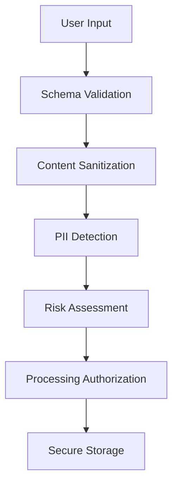

# Data Handling Guidelines - Idea-to-PRD Skill

**Document Version**: 1.0
**Date**: 2026-02-11
**Classification**: Internal
**Compliance**: GDPR, CCPA, SOC2

---

## Data Classification

### Input Data Categories

| Data Type | Classification | Retention | Encryption |
|-----------|---------------|-----------|------------|
| Product Ideas | Confidential | 30 days | AES-256 |
| Business Strategy | Confidential | 30 days | AES-256 |
| Stakeholder Info | PII/Personal | 30 days | AES-256 |
| Market Research | Internal | 90 days | AES-256 |
| Technical Specs | Internal | 30 days | AES-256 |
| User Preferences | Personal | 1 year | AES-256 |

### Processing Data

| Data Type | Location | Access Control | Monitoring |
|-----------|----------|---------------|------------|
| Temporary Files | Encrypted /tmp | Process-only | File integrity |
| Memory Objects | Protected heap | Session-scoped | Memory protection |
| Log Data | Secure storage | Admin-only | SIEM integration |
| Cache Data | Encrypted Redis | Time-limited | Cache monitoring |

## Data Lifecycle Management

### Data Collection


#### Collection Principles
- **Minimal Collection**: Only collect data necessary for PRD generation
- **Purpose Limitation**: Data used only for stated purpose
- **Consent**: Explicit user consent for sensitive data processing
- **Transparency**: Clear disclosure of data usage

### Data Processing

#### Security Controls
1. **Input Validation**
   - JSON schema validation against predefined schemas
   - Content-type verification and size limits
   - Character encoding validation (UTF-8 only)
   - Regular expression patterns for data formats

2. **Sanitization Pipeline**
   ```typescript
   // Input sanitization process
   const sanitizedInput = input
     .stripHTMLTags()
     .encodeSpecialCharacters()
     .validateStringLengths()
     .filterProfanity()
     .detectPII()
     .applyBusinessRules();
   ```

3. **Content Filtering**
   - PII detection and masking
   - Sensitive data pattern matching
   - Competitive intelligence filtering
   - Malicious content detection

#### Processing Environment
- **Sandboxed Execution**: Isolated processing environment
- **Resource Limits**: Memory, CPU, and time constraints
- **Process Isolation**: Separate processes per user session
- **Secure IPC**: Encrypted inter-process communication

### Data Storage

#### Temporary Storage
```bash
# Secure temporary directory creation
TEMP_DIR="/tmp/idea-prd-$(uuid)-$(date +%s)"
mkdir -p "$TEMP_DIR"
chmod 700 "$TEMP_DIR"
chown process:process "$TEMP_DIR"

# File encryption
echo "sensitive data" | openssl enc -aes-256-cbc -salt -out "$TEMP_DIR/encrypted.data"
```

#### Storage Security
- **Encryption at Rest**: AES-256 encryption for all files
- **Access Controls**: Strict file permissions (700/600)
- **Secure Deletion**: Cryptographic wiping of temporary files
- **Backup Security**: Encrypted backups with separate key management

### Data Transmission

#### In-Transit Protection
```typescript
// HTTPS with TLS 1.3 minimum
const httpsConfig = {
  protocol: 'https',
  secureProtocol: 'TLSv1_3_method',
  ciphers: 'ECDHE-RSA-AES256-GCM-SHA384:ECDHE-RSA-AES128-GCM-SHA256',
  honorCipherOrder: true,
  checkServerIdentity: true
};
```

#### API Security
- **Authentication**: OAuth 2.0 with JWT tokens
- **Authorization**: Role-based access control (RBAC)
- **Request Signing**: HMAC signature verification
- **Rate Limiting**: 60 requests per minute per user

### Data Retention

#### Retention Policies
| Data Category | Retention Period | Justification |
|---------------|-----------------|---------------|
| Processing Data | Session duration | Operational requirement |
| Audit Logs | 7 years | Compliance requirement |
| User Preferences | 1 year | User experience |
| Error Logs | 90 days | Debugging and monitoring |
| Performance Metrics | 1 year | System optimization |

#### Automated Cleanup
```bash
#!/bin/bash
# Automated data cleanup script
find /tmp/idea-prd-* -mtime +1 -type f -exec shred -vfz -n 3 {} \;
find /logs/audit -mtime +2555 -type f -delete  # 7 years
find /cache/redis -mtime +30 -type f -delete
```

### Data Destruction

#### Secure Deletion Process
1. **Cryptographic Erasure**: Delete encryption keys
2. **Overwriting**: Multiple-pass overwriting (DoD 5220.22-M)
3. **Verification**: Confirm complete deletion
4. **Audit Trail**: Log all deletion operations

```typescript
// Secure file deletion
async function secureDelete(filePath: string): Promise<void> {
  // Overwrite with random data (3 passes)
  for (let i = 0; i < 3; i++) {
    const randomData = crypto.randomBytes(fs.statSync(filePath).size);
    fs.writeFileSync(filePath, randomData);
    fs.fsyncSync(fs.openSync(filePath, 'r+'));
  }

  // Zero out the file
  fs.writeFileSync(filePath, Buffer.alloc(fs.statSync(filePath).size));
  fs.fsyncSync(fs.openSync(filePath, 'r+'));

  // Delete the file
  fs.unlinkSync(filePath);

  // Log the deletion
  auditLogger.info('File securely deleted', { filePath, timestamp: Date.now() });
}
```

## Privacy Controls

### GDPR Compliance

#### Rights Implementation
1. **Right to Information**: Clear privacy notices
2. **Right of Access**: Data export functionality
3. **Right of Rectification**: Data correction mechanisms
4. **Right to Erasure**: Secure data deletion
5. **Right to Portability**: Structured data export
6. **Right to Object**: Opt-out mechanisms

#### Data Protection by Design
```typescript
// Privacy-preserving data processing
class PrivacyAwareProcessor {
  constructor() {
    this.dataMinimization = true;
    this.purposeLimitation = true;
    this.storageMinimization = true;
    this.transparencyLogging = true;
  }

  async processIdea(input: IdeaInput): Promise<ProcessedOutput> {
    // Check consent
    if (!this.verifyConsent(input.userId)) {
      throw new Error('User consent required');
    }

    // Minimize data
    const minimizedInput = this.minimizeData(input);

    // Process with privacy protection
    const result = await this.privateProcess(minimizedInput);

    // Log for transparency
    this.logProcessing(input.userId, result.metadata);

    return result;
  }
}
```

### Consent Management

#### Consent Types
- **Processing Consent**: Agreement to process business ideas
- **Analytics Consent**: Agreement to performance tracking
- **Marketing Consent**: Agreement to product communications
- **Research Consent**: Agreement to anonymized research use

#### Consent Storage
```json
{
  "userId": "user-123",
  "consents": {
    "processing": {
      "granted": true,
      "timestamp": "2026-02-11T15:30:00Z",
      "version": "1.0",
      "ipAddress": "192.168.1.100"
    },
    "analytics": {
      "granted": false,
      "timestamp": "2026-02-11T15:30:00Z",
      "version": "1.0"
    }
  },
  "withdrawalHistory": []
}
```

## Monitoring and Compliance

### Data Access Monitoring

#### Access Logging
```typescript
// Comprehensive access logging
interface AccessLog {
  userId: string;
  action: 'create' | 'read' | 'update' | 'delete';
  resource: string;
  timestamp: string;
  ipAddress: string;
  userAgent: string;
  success: boolean;
  dataClassification: string;
}

class AccessMonitor {
  async logAccess(event: AccessLog): Promise<void> {
    // Log to secure audit system
    await this.auditLogger.log(event);

    // Real-time monitoring for sensitive data
    if (event.dataClassification === 'Confidential') {
      await this.alertingSystem.notify('sensitive-data-access', event);
    }

    // SIEM integration
    await this.siemIntegration.send(event);
  }
}
```

#### Anomaly Detection
- **Unusual Access Patterns**: Multiple failed attempts
- **Large Data Requests**: Requests exceeding normal size
- **Off-Hours Access**: Access outside business hours
- **Geographic Anomalies**: Access from unusual locations

### Compliance Auditing

#### Automated Compliance Checks
```bash
#!/bin/bash
# Daily compliance check script

echo "Starting compliance audit..."

# Check data retention compliance
python3 /scripts/check-retention-policy.py

# Verify encryption compliance
bash /scripts/verify-encryption.sh

# Check access control compliance
python3 /scripts/audit-access-controls.py

# Generate compliance report
python3 /scripts/generate-compliance-report.py

echo "Compliance audit complete"
```

#### Audit Trail Requirements
- **Immutable Logs**: Tamper-evident audit logging
- **Complete Coverage**: All data operations logged
- **Real-time Monitoring**: Immediate alerting for violations
- **Long-term Retention**: 7-year retention for compliance logs

### Incident Response

#### Data Breach Response Plan
1. **Detection**: Automated monitoring and alerting
2. **Assessment**: Determine scope and impact
3. **Containment**: Isolate affected systems
4. **Investigation**: Root cause analysis
5. **Notification**: Regulatory and user notifications
6. **Recovery**: System restoration and hardening

#### Breach Notification Timeline
- **Internal Notification**: Immediate (within 1 hour)
- **Regulatory Notification**: 72 hours (GDPR requirement)
- **User Notification**: 72 hours if high risk to rights
- **Public Disclosure**: As required by regulations

## Security Controls Summary

### Technical Controls
- **Encryption**: AES-256 for data at rest, TLS 1.3 for transit
- **Access Control**: RBAC with principle of least privilege
- **Input Validation**: Comprehensive schema and content validation
- **Monitoring**: Real-time security and compliance monitoring

### Administrative Controls
- **Policies**: Comprehensive data handling policies
- **Training**: Regular security awareness training
- **Audits**: Regular compliance audits and assessments
- **Incident Response**: Documented response procedures

### Physical Controls
- **Secure Infrastructure**: SOC2-compliant hosting environment
- **Environmental Controls**: Secure data center facilities
- **Access Controls**: Physical access restrictions
- **Asset Management**: Inventory and tracking of data assets

---

**Document Approval**:
- Data Protection Officer: [Signature Required]
- Security Architect: [Signature Required]
- Compliance Officer: [Signature Required]

**Next Review Date**: 2026-05-11
**Version Control**: All changes tracked in audit log