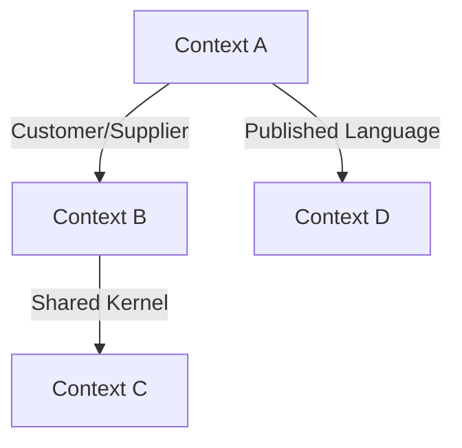
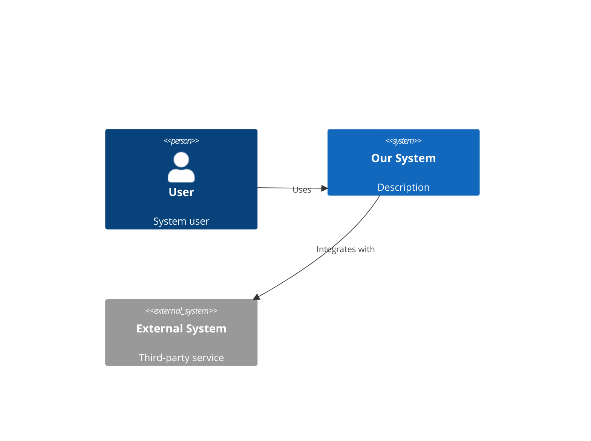
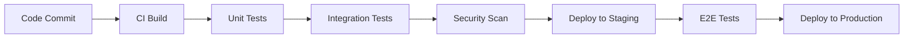

# Expected Outputs and Validation Criteria

## Overview

This document defines the expected outputs and comprehensive validation criteria for the idea2prd-manual skill across all phases and scenarios.

## Output Structure Validation

### Complete File Structure

For successful skill execution, the following file structure should be generated:

```
project_name/
├── docs/
│   ├── PRD.md                           # Product Requirements Document
│   ├── executive-summary.md             # High-level overview
│   ├── ddd-strategic/
│   │   ├── bounded-contexts.md          # Domain boundaries
│   │   ├── context-map.md              # Context relationships
│   │   └── domain-glossary.md          # Business terminology
│   ├── architecture/
│   │   ├── adrs/                       # Architecture Decision Records
│   │   │   ├── 001-architecture-style.md
│   │   │   ├── 002-data-storage.md
│   │   │   ├── 003-communication-patterns.md
│   │   │   ├── 004-security-approach.md
│   │   │   ├── 005-deployment-strategy.md
│   │   │   ├── 006-monitoring-logging.md
│   │   │   ├── 007-error-handling.md
│   │   │   ├── 008-performance-optimization.md
│   │   │   ├── 009-scalability-strategy.md
│   │   │   └── 010-technology-choices.md
│   │   └── c4-diagrams/
│   │       ├── c4-context.md           # C4 Context diagram
│   │       ├── c4-container.md         # C4 Container diagram
│   │       ├── c4-component.md         # C4 Component diagram
│   │       └── c4-code.md              # C4 Code diagram
│   ├── ddd-tactical/
│   │   ├── aggregates.md               # Domain aggregates
│   │   ├── entities.md                 # Domain entities
│   │   ├── value-objects.md            # Value objects
│   │   ├── domain-services.md          # Domain services
│   │   ├── repositories.md             # Repository patterns
│   │   └── schema.sql                  # Database schema
│   ├── pseudocode/
│   │   ├── core-algorithms.md          # Main algorithm logic
│   │   ├── api-flows.md                # API interaction flows
│   │   ├── business-processes.md       # Business rule implementation
│   │   └── integration-patterns.md     # External system integration
│   ├── validation/
│   │   ├── fitness-functions.md        # Quality gates and metrics
│   │   ├── test-scenarios.md           # Test specifications (Gherkin)
│   │   └── acceptance-tests.md         # User acceptance criteria
│   └── completion/
│       ├── deployment-plan.md          # Deployment strategy
│       ├── cicd-setup.md              # CI/CD configuration
│       ├── monitoring-strategy.md      # Monitoring and alerting
│       └── maintenance-guide.md        # Operational procedures
└── .ai-context/
    ├── summary.json                    # AI-readable project summary
    ├── bounded-contexts.json           # Structured domain data
    ├── glossary.json                   # Terminology definitions
    ├── adrs.json                       # ADR summaries
    └── fitness-rules.json              # Quality constraints
```

---

## Expected Content Validation

### 1. PRD.md (Product Requirements Document)

**Required Sections:**
```markdown
# [Product Name] - Product Requirements Document

## 1. Executive Summary
- Product vision and mission
- Key value propositions
- Success metrics

## 2. Product Overview
- Problem statement
- Target users and personas
- Market opportunity
- Competitive landscape

## 3. Functional Requirements
### 3.1 Core Features
- Feature descriptions with priorities
- User stories in format: "As a [user], I want [goal] so that [benefit]"
- Acceptance criteria for each feature

### 3.2 Non-Functional Requirements
- Performance requirements
- Security requirements
- Scalability requirements
- Usability requirements

## 4. User Experience
- User journey maps
- Key user workflows
- Interface requirements

## 5. Technical Considerations
- Technology stack preferences
- Integration requirements
- Data requirements
- Platform requirements

## 6. Success Metrics
- Key Performance Indicators (KPIs)
- Success criteria
- Measurement methods

## 7. Timeline and Milestones
- Development phases
- Key milestones
- Dependencies

## 8. Risks and Assumptions
- Technical risks
- Business risks
- Key assumptions
```

**Validation Criteria:**
- [ ] All 8 sections present and populated
- [ ] User stories follow proper format
- [ ] Acceptance criteria are testable
- [ ] Metrics are measurable and specific
- [ ] Timeline is realistic and detailed
- [ ] Content length: 2,000-5,000 words
- [ ] No placeholder text (TODO, TBD, etc.)
- [ ] Proper markdown formatting

### 2. DDD Strategic Documentation

#### 2.1 bounded-contexts.md

**Expected Content:**
```markdown
# Bounded Contexts

## Context Map Overview
[Visual representation of context relationships]

## Core Contexts
### [Context Name 1]
- **Responsibility**: [Primary domain responsibility]
- **Type**: Core/Supporting/Generic
- **Key Entities**: [List of main domain entities]
- **Ubiquitous Language**: [Domain-specific terms]
- **Integration Patterns**: [How it connects to other contexts]

[Repeat for each context]

## Context Integration Patterns
- Shared Kernel
- Customer/Supplier
- Conformist
- Anti-corruption Layer
- Open/Host Service
- Published Language
```

**Validation Criteria:**
- [ ] At least 2 bounded contexts defined
- [ ] Each context has clear responsibility
- [ ] Context types properly classified
- [ ] Integration patterns specified
- [ ] Ubiquitous language documented
- [ ] No overlapping responsibilities

#### 2.2 context-map.md

**Expected Content:**
```markdown
# Context Map

## Strategic Design Overview
[Description of overall domain strategy]

## Context Relationships


## Integration Details
### [Context A] ↔ [Context B]
- **Pattern**: Customer/Supplier
- **Direction**: [A is customer/supplier of B]
- **Interface**: [API/Event/Shared DB]
- **Data Flow**: [Description of data exchange]
```

**Validation Criteria:**
- [ ] Visual context map present (Mermaid diagram)
- [ ] All relationships documented
- [ ] Integration patterns specified
- [ ] Data flow directions clear
- [ ] Interface types defined

### 3. Architecture Documentation

#### 3.1 ADR Structure Validation

Each ADR should follow the standard format:

```markdown
# ADR-[Number]: [Title]

## Status
[Proposed/Accepted/Deprecated/Superseded]

## Context
[Background and problem statement]

## Decision
[The architectural decision made]

## Rationale
[Reasoning behind the decision]

## Consequences
### Positive
- [List of positive outcomes]

### Negative
- [List of negative trade-offs]

### Neutral
- [Other implications]

## References
- [Links to related documents/research]
```

**ADR Coverage Requirements:**
1. **Architecture Style** (Microservices/Monolith/Hybrid)
2. **Data Storage** (Database technology and patterns)
3. **Communication Patterns** (Sync/Async, protocols)
4. **Security Approach** (Authentication, authorization, encryption)
5. **Deployment Strategy** (Containerization, orchestration)
6. **Monitoring & Logging** (Observability strategy)
7. **Error Handling** (Fault tolerance, circuit breakers)
8. **Performance Optimization** (Caching, scaling)
9. **Scalability Strategy** (Horizontal/vertical scaling)
10. **Technology Choices** (Frameworks, languages, tools)

#### 3.2 C4 Diagrams

**C4 Context Diagram:**
```markdown
# C4 Context Diagram

## System Context


## Context Description
[Detailed explanation of system boundaries and external dependencies]
```

**Validation Criteria for C4 Diagrams:**
- [ ] All 4 levels present (Context, Container, Component, Code)
- [ ] Proper C4 notation used in Mermaid
- [ ] Clear system boundaries
- [ ] External dependencies identified
- [ ] Technology choices documented
- [ ] Relationships properly labeled

### 4. DDD Tactical Documentation

#### 4.1 aggregates.md

**Expected Structure:**
```markdown
# Domain Aggregates

## [Aggregate Name 1]
### Purpose
[What this aggregate represents and why it exists]

### Aggregate Root
- **Entity**: [Root entity name]
- **Identity**: [How identity is managed]

### Entities
- [Entity 1]: [Description]
- [Entity 2]: [Description]

### Value Objects
- [Value Object 1]: [Properties and behavior]
- [Value Object 2]: [Properties and behavior]

### Business Rules
1. [Rule 1]: [Description and enforcement]
2. [Rule 2]: [Description and enforcement]

### Domain Events
- [Event 1]: [When triggered, what data included]
- [Event 2]: [When triggered, what data included]

### Repository Interface
```typescript
interface [Aggregate]Repository {
    findById(id: [AggregateId]): Promise<[Aggregate] | null>;
    save(aggregate: [Aggregate]): Promise<void>;
    // Additional methods
}
```
```

**Validation Criteria:**
- [ ] At least 2 aggregates defined
- [ ] Each aggregate has clear purpose
- [ ] Aggregate roots identified
- [ ] Business rules documented
- [ ] Domain events specified
- [ ] Repository interfaces defined

#### 4.2 schema.sql

**Expected Content:**
```sql
-- Database Schema for [Project Name]
-- Generated by idea2prd-manual skill

-- [Aggregate 1] Tables
CREATE TABLE [aggregate_1] (
    id UUID PRIMARY KEY DEFAULT gen_random_uuid(),
    [field_1] VARCHAR(255) NOT NULL,
    [field_2] INTEGER,
    created_at TIMESTAMP DEFAULT CURRENT_TIMESTAMP,
    updated_at TIMESTAMP DEFAULT CURRENT_TIMESTAMP
);

-- Indexes
CREATE INDEX idx_[aggregate_1]_[field] ON [aggregate_1]([field]);

-- Domain Events Table
CREATE TABLE domain_events (
    id UUID PRIMARY KEY DEFAULT gen_random_uuid(),
    aggregate_type VARCHAR(100) NOT NULL,
    aggregate_id UUID NOT NULL,
    event_type VARCHAR(100) NOT NULL,
    event_data JSONB NOT NULL,
    occurred_at TIMESTAMP DEFAULT CURRENT_TIMESTAMP,
    processed_at TIMESTAMP NULL
);

-- Additional tables for other aggregates...
```

**Validation Criteria:**
- [ ] Tables for all aggregates present
- [ ] Primary keys properly defined
- [ ] Foreign key constraints where appropriate
- [ ] Indexes for performance
- [ ] Domain events table included
- [ ] Proper data types used
- [ ] Creation/update timestamps included

### 5. Pseudocode Documentation

#### 5.1 core-algorithms.md

**Expected Structure:**
```markdown
# Core Algorithms

## [Algorithm Name 1]
### Purpose
[What this algorithm does and why it's important]

### Input
- [Parameter 1]: [Type and description]
- [Parameter 2]: [Type and description]

### Output
- [Return value]: [Type and description]

### Pseudocode
```
BEGIN [AlgorithmName]
    INPUT: parameter1, parameter2
    OUTPUT: result

    1. VALIDATE inputs
        IF parameter1 is null THEN
            THROW InvalidInputException
        END IF

    2. INITIALIZE variables
        SET result = empty
        SET counter = 0

    3. PROCESS main logic
        WHILE counter < parameter2 DO
            CALL processItem(parameter1[counter])
            INCREMENT counter
        END WHILE

    4. RETURN result
END
```

### Time Complexity
O([complexity description])

### Space Complexity
O([complexity description])

### Error Handling
- [Error type 1]: [How handled]
- [Error type 2]: [How handled]
```

**Validation Criteria:**
- [ ] All core business algorithms documented
- [ ] Pseudocode follows consistent notation
- [ ] Input/output specifications clear
- [ ] Error handling documented
- [ ] Complexity analysis provided
- [ ] Implementation notes included

### 6. Validation Documentation

#### 6.1 fitness-functions.md

**Expected Structure:**
```markdown
# Fitness Functions

## Performance Fitness Functions
### Response Time
- **Threshold**: < 500ms for 95th percentile
- **Measurement**: API response times
- **Frequency**: Continuous monitoring
- **Failure Action**: Alert team, investigate performance

### Throughput
- **Threshold**: > 1000 requests/second
- **Measurement**: Request processing capacity
- **Frequency**: Load testing weekly
- **Failure Action**: Scale infrastructure, optimize code

## Quality Fitness Functions
### Code Coverage
- **Threshold**: > 80% line coverage
- **Measurement**: Unit test coverage reports
- **Frequency**: Every commit
- **Failure Action**: Block deployment, add tests

### Security Compliance
- **Threshold**: Zero critical vulnerabilities
- **Measurement**: Security scanning tools
- **Frequency**: Daily scans
- **Failure Action**: Immediate fix required

## Business Fitness Functions
### User Satisfaction
- **Threshold**: > 4.5/5 average rating
- **Measurement**: User feedback surveys
- **Frequency**: Monthly collection
- **Failure Action**: UX improvement sprint
```

**Validation Criteria:**
- [ ] Performance metrics defined
- [ ] Quality gates established
- [ ] Business metrics included
- [ ] Thresholds are measurable
- [ ] Measurement methods specified
- [ ] Failure actions defined

#### 6.2 test-scenarios.md

**Expected Gherkin Format:**
```gherkin
# Test Scenarios

## Feature: User Authentication
As a user
I want to securely authenticate
So that I can access my account safely

### Scenario: Successful login with valid credentials
Given I am on the login page
When I enter valid username "user@example.com"
And I enter valid password "SecurePassword123!"
And I click the login button
Then I should be redirected to the dashboard
And I should see my profile information

### Scenario: Failed login with invalid password
Given I am on the login page
When I enter valid username "user@example.com"
And I enter invalid password "WrongPassword"
And I click the login button
Then I should see an error message "Invalid credentials"
And I should remain on the login page

### Scenario: Account lockout after multiple failed attempts
Given I am on the login page
When I attempt to login with wrong password 5 times
Then my account should be temporarily locked
And I should see a message "Account locked for security"
```

**Validation Criteria:**
- [ ] All major features have scenarios
- [ ] Gherkin syntax properly used
- [ ] Given-When-Then format consistent
- [ ] Edge cases covered
- [ ] Error conditions tested
- [ ] User personas addressed

### 7. Completion Documentation

#### 7.1 deployment-plan.md

**Expected Structure:**
```markdown
# Deployment Plan

## Deployment Strategy
### Blue-Green Deployment
[Description of deployment approach and rationale]

## Infrastructure Requirements
### Production Environment
- **Compute**: [Server specifications]
- **Storage**: [Database and file storage requirements]
- **Network**: [Bandwidth and connectivity needs]
- **Security**: [Firewall and security group configurations]

## Deployment Pipeline


## Pre-deployment Checklist
- [ ] All tests passing
- [ ] Security scan complete
- [ ] Database migrations ready
- [ ] Feature flags configured
- [ ] Monitoring alerts configured

## Rollback Strategy
1. [Step-by-step rollback procedures]
2. [Database rollback considerations]
3. [Communication plan]
```

**Validation Criteria:**
- [ ] Deployment strategy clearly defined
- [ ] Infrastructure requirements specified
- [ ] Pipeline visualization included
- [ ] Checklists are actionable
- [ ] Rollback procedures documented
- [ ] Monitoring strategy included

---

## AI Context Validation

### .ai-context/summary.json

**Expected Structure:**
```json
{
  "product_name": "[Product Name]",
  "description": "[Brief product description]",
  "domain": "[Business domain]",
  "architecture_style": "[Microservices/Monolith/Hybrid]",
  "tech_stack": {
    "backend": "[Technology choices]",
    "frontend": "[Technology choices]",
    "database": "[Database technology]",
    "infrastructure": "[Cloud/deployment platform]"
  },
  "bounded_contexts": [
    {
      "name": "[Context name]",
      "type": "[Core/Supporting/Generic]",
      "responsibility": "[Primary responsibility]"
    }
  ],
  "key_features": [
    "[Feature 1]",
    "[Feature 2]"
  ],
  "non_functional_requirements": {
    "performance": "[Performance targets]",
    "security": "[Security requirements]",
    "scalability": "[Scalability needs]"
  },
  "success_metrics": [
    "[Metric 1]",
    "[Metric 2]"
  ]
}
```

**Validation Criteria:**
- [ ] Valid JSON format
- [ ] All required fields present
- [ ] Data matches PRD content
- [ ] Structured for AI consumption
- [ ] No sensitive information included

---

## Quality Assurance Checklist

### Content Quality

#### Completeness
- [ ] All required files generated
- [ ] No placeholder content (TODO, TBD)
- [ ] All sections populated with meaningful content
- [ ] Cross-references between documents consistent

#### Accuracy
- [ ] Technical specifications are feasible
- [ ] Business requirements align with problem/idea
- [ ] Architecture decisions support requirements
- [ ] Test scenarios cover functional requirements

#### Consistency
- [ ] Terminology consistent across documents
- [ ] Architecture decisions align with C4 diagrams
- [ ] Database schema matches domain model
- [ ] Pseudocode reflects business rules

### Security Validation

#### Content Security
- [ ] No hardcoded secrets or credentials
- [ ] No sensitive personal information
- [ ] No internal system details exposed
- [ ] API examples use placeholder data

#### File Security
- [ ] All files within workspace boundary
- [ ] No executable files created
- [ ] Proper file permissions set
- [ ] No symbolic links to sensitive areas

### Performance Validation

#### Generation Time
- [ ] Total execution time < 15 minutes
- [ ] Individual phase time within limits
- [ ] Memory usage reasonable (< 512MB)
- [ ] No resource leaks detected

#### Output Size
- [ ] Total documentation size reasonable (< 50MB)
- [ ] Individual files appropriately sized
- [ ] No excessively large generated content
- [ ] Efficient file organization

---

## Test Result Categories

### PASS Criteria

A test **PASSES** when:
- All required files generated
- Content quality meets standards
- Security validations successful
- Performance within acceptable limits
- No critical errors during execution

### FAIL Criteria

A test **FAILS** when:
- Missing required documentation files
- Content contains security vulnerabilities
- Performance exceeds acceptable limits
- Critical errors during execution
- Generated content is incomplete or incorrect

### WARNING Criteria

A test generates **WARNING** when:
- Minor content quality issues
- Performance near limits but acceptable
- Non-critical errors handled gracefully
- Some optional content missing

---

## Validation Automation

### Automated Checks

```bash
#!/bin/bash
# validate-outputs.sh

# File structure validation
check_file_structure() {
    required_files=(
        "docs/PRD.md"
        "docs/executive-summary.md"
        "docs/ddd-strategic/bounded-contexts.md"
        "docs/architecture/adrs"
        ".ai-context/summary.json"
    )

    for file in "${required_files[@]}"; do
        if [[ ! -e "$file" ]]; then
            echo "FAIL: Required file missing: $file"
            return 1
        fi
    done

    echo "PASS: File structure validation"
    return 0
}

# Content validation
check_content_quality() {
    # Check for placeholder content
    if grep -r "TODO\|TBD\|FIXME" docs/ > /dev/null; then
        echo "FAIL: Placeholder content found"
        return 1
    fi

    # Check minimum content length
    prd_words=$(wc -w < docs/PRD.md)
    if [[ $prd_words -lt 2000 ]]; then
        echo "FAIL: PRD.md too short ($prd_words words < 2000)"
        return 1
    fi

    echo "PASS: Content quality validation"
    return 0
}

# Security validation
check_security() {
    # Check for secrets
    if grep -r -i "password\|secret\|key\|token" docs/ | grep -v "example\|placeholder" > /dev/null; then
        echo "WARNING: Potential secrets in documentation"
    fi

    # Check file permissions
    find docs/ -type f -perm -o+w > /dev/null && {
        echo "FAIL: World-writable files found"
        return 1
    }

    echo "PASS: Security validation"
    return 0
}

# Run all validations
main() {
    echo "🔍 Validating outputs..."

    check_file_structure || exit 1
    check_content_quality || exit 1
    check_security || exit 1

    echo "✅ All validations passed!"
}

main "$@"
```

### Validation Metrics

| Metric | Target | Measurement |
|--------|--------|-------------|
| **File Completeness** | 100% | All required files present |
| **Content Quality** | > 90% | Meaningful content, no placeholders |
| **Security Compliance** | 100% | No vulnerabilities detected |
| **Performance** | < 15 min | Total generation time |
| **Accuracy** | > 95% | Content matches requirements |

This comprehensive validation framework ensures the idea2prd-manual skill generates high-quality, secure, and complete documentation that meets all specified requirements.