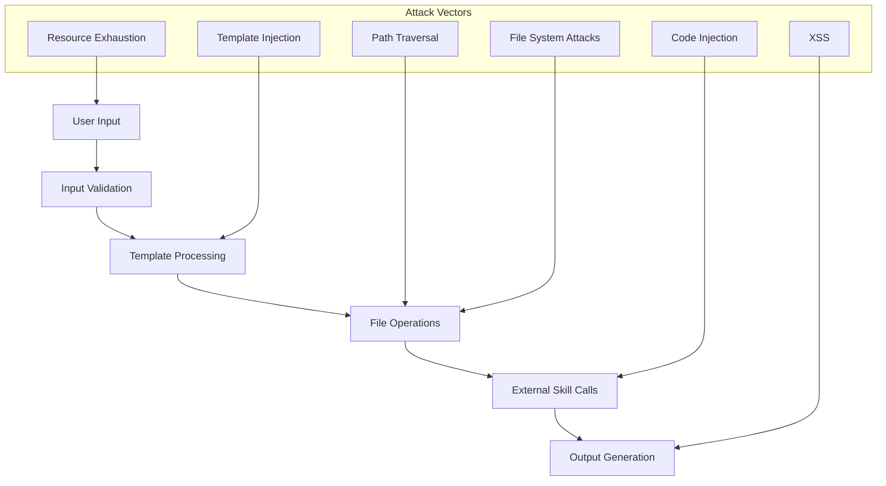

# Security Testing Framework for Idea-to-PRD Skill

## Security Testing Overview

This document provides comprehensive security validation tests for the idea2prd-manual skill, focusing on preventing common attack vectors and ensuring secure operation.

## Security Threat Model

### Attack Surface Analysis



### Security Controls

| Control Type | Implementation | Test Coverage |
|-------------|----------------|---------------|
| **Input Validation** | Whitelist filtering | SEC-100 series |
| **Output Encoding** | HTML/Markdown escaping | SEC-200 series |
| **Path Sanitization** | Canonical path checking | SEC-300 series |
| **Template Security** | Sandboxed processing | SEC-400 series |
| **File System Guards** | Chroot-like restrictions | SEC-500 series |
| **Resource Limits** | Timeouts and size limits | SEC-600 series |

---

## SEC-100: Input Validation Tests

### SEC-101: Malicious String Injection

**Objective**: Prevent code injection through user inputs

**Test Cases**:

```yaml
test_cases:
  - id: SEC-101-1
    name: "SQL Injection Prevention"
    input: "'; DROP TABLE projects; --"
    field: "product_name"
    expected: "Sanitized literal text"
    severity: "CRITICAL"

  - id: SEC-101-2
    name: "Command Injection Prevention"
    input: "; rm -rf / ;"
    field: "description"
    expected: "Command characters escaped"
    severity: "CRITICAL"

  - id: SEC-101-3
    name: "JavaScript Injection Prevention"
    input: "<script>window.location='evil.com'</script>"
    field: "user_story"
    expected: "Script tags removed/escaped"
    severity: "HIGH"

  - id: SEC-101-4
    name: "Template Literal Injection"
    input: "${global.process.mainModule.require('child_process').exec('cat /etc/passwd')}"
    field: "requirements"
    expected: "Template literals treated as literal text"
    severity: "CRITICAL"

  - id: SEC-101-5
    name: "Unicode Bypass Attempts"
    input: "\u003cscript\u003ealert('xss')\u003c/script\u003e"
    field: "acceptance_criteria"
    expected: "Unicode encoding normalized and filtered"
    severity: "HIGH"
```

**Validation Script**:

```python
#!/usr/bin/env python3
"""
SEC-101: Input validation test suite
"""

import re
import html
from typing import List, Dict

class InputValidator:
    """Secure input validation for idea2prd skill."""

    DANGEROUS_PATTERNS = [
        r'<script[^>]*>.*?</script>',  # Script tags
        r'javascript:',                # JavaScript protocol
        r'on\w+\s*=',                 # Event handlers
        r'\$\{.*?\}',                 # Template literals
        r'<%.*?%>',                   # Server-side templates
        r'\{\{.*?\}\}',               # Mustache templates
        r';\s*(rm|del|format)',       # Dangerous commands
        r'(union|select|drop|insert|update|delete)\s',  # SQL keywords
    ]

    def sanitize_input(self, text: str) -> str:
        """Sanitize user input for security."""
        if not text:
            return ""

        # Normalize unicode
        text = text.encode('unicode_escape').decode('ascii')

        # Remove dangerous patterns
        for pattern in self.DANGEROUS_PATTERNS:
            text = re.sub(pattern, '', text, flags=re.IGNORECASE)

        # HTML escape
        text = html.escape(text)

        # Limit length
        if len(text) > 10000:
            text = text[:10000] + "... [truncated]"

        return text

    def validate_field(self, field_name: str, value: str) -> Dict:
        """Validate a specific field."""
        original_value = value
        sanitized_value = self.sanitize_input(value)

        is_safe = original_value == sanitized_value

        return {
            'field': field_name,
            'original': original_value,
            'sanitized': sanitized_value,
            'is_safe': is_safe,
            'changes_made': not is_safe
        }

def run_sec_101_tests():
    """Execute SEC-101 test suite."""
    validator = InputValidator()

    test_cases = [
        ("product_name", "'; DROP TABLE projects; --"),
        ("description", "; rm -rf / ;"),
        ("user_story", "<script>window.location='evil.com'</script>"),
        ("requirements", "${global.process.mainModule.require('child_process').exec('cat /etc/passwd')}"),
        ("acceptance_criteria", "\u003cscript\u003ealert('xss')\u003c/script\u003e")
    ]

    results = []
    for field, malicious_input in test_cases:
        result = validator.validate_field(field, malicious_input)
        results.append(result)

        print(f"SEC-101 Test - Field: {field}")
        print(f"  Input: {result['original'][:50]}...")
        print(f"  Safe: {result['is_safe']}")
        print(f"  Sanitized: {result['sanitized'][:50]}...")
        print()

    return results

if __name__ == "__main__":
    run_sec_101_tests()
```

### SEC-102: File Upload Security

**Objective**: Prevent malicious file uploads and processing

**Test Cases**:

```yaml
test_cases:
  - id: SEC-102-1
    name: "Executable File Prevention"
    input_file: "malware.exe"
    expected: "File rejected - executable not allowed"
    severity: "CRITICAL"

  - id: SEC-102-2
    name: "Script File Prevention"
    input_file: "payload.sh"
    expected: "File rejected - script not allowed"
    severity: "HIGH"

  - id: SEC-102-3
    name: "Hidden File Prevention"
    input_file: ".bashrc"
    expected: "File rejected - hidden files not allowed"
    severity: "MEDIUM"

  - id: SEC-102-4
    name: "Large File Prevention"
    input_file: "huge.txt (100MB)"
    expected: "File rejected - size limit exceeded"
    severity: "MEDIUM"

  - id: SEC-102-5
    name: "NULL Byte Injection"
    input_file: "document.txt\x00.exe"
    expected: "NULL bytes stripped, extension validated"
    severity: "HIGH"
```

---

## SEC-200: Output Encoding Tests

### SEC-201: Cross-Site Scripting (XSS) Prevention

**Objective**: Ensure all outputs are properly encoded

**Test Implementation**:

```python
#!/usr/bin/env python3
"""
SEC-201: XSS Prevention Test Suite
"""

import html
import re
from urllib.parse import quote

class OutputEncoder:
    """Secure output encoding for generated documents."""

    def encode_for_html(self, text: str) -> str:
        """Encode text for safe HTML output."""
        return html.escape(text, quote=True)

    def encode_for_markdown(self, text: str) -> str:
        """Encode text for safe Markdown output."""
        # Escape Markdown special characters
        special_chars = ['*', '_', '`', '[', ']', '(', ')', '#', '+', '-', '.', '!']
        for char in special_chars:
            text = text.replace(char, f'\\{char}')
        return text

    def encode_for_json(self, text: str) -> str:
        """Encode text for safe JSON output."""
        import json
        return json.dumps(text)[1:-1]  # Remove quotes

    def validate_output(self, content: str, output_type: str) -> Dict:
        """Validate output encoding."""
        dangerous_patterns = [
            r'<script[^>]*>',
            r'javascript:',
            r'on\w+\s*=',
            r'\{\{[^}]+\}\}',
            r'\$\{[^}]+\}'
        ]

        issues = []
        for pattern in dangerous_patterns:
            if re.search(pattern, content, re.IGNORECASE):
                issues.append(f"Dangerous pattern found: {pattern}")

        return {
            'output_type': output_type,
            'is_safe': len(issues) == 0,
            'issues': issues,
            'content_length': len(content)
        }

def run_sec_201_tests():
    """Execute SEC-201 XSS prevention tests."""
    encoder = OutputEncoder()

    test_inputs = [
        "<script>alert('xss')</script>",
        "javascript:void(0)",
        "",
        "{{constructor.constructor('alert(1)')()}}",
        "${alert('injection')}"
    ]

    for test_input in test_inputs:
        print(f"SEC-201 Test Input: {test_input}")

        # Test HTML encoding
        html_encoded = encoder.encode_for_html(test_input)
        html_result = encoder.validate_output(html_encoded, 'html')
        print(f"  HTML Safe: {html_result['is_safe']}")

        # Test Markdown encoding
        md_encoded = encoder.encode_for_markdown(test_input)
        md_result = encoder.validate_output(md_encoded, 'markdown')
        print(f"  Markdown Safe: {md_result['is_safe']}")

        print()

if __name__ == "__main__":
    run_sec_201_tests()
```

---

## SEC-300: Path Traversal Prevention

### SEC-301: Directory Traversal Attacks

**Objective**: Prevent unauthorized file system access

**Test Cases**:

```yaml
test_cases:
  - id: SEC-301-1
    name: "Basic Directory Traversal"
    path: "../../../etc/passwd"
    expected: "Path normalized to workspace boundary"
    severity: "CRITICAL"

  - id: SEC-301-2
    name: "URL Encoded Traversal"
    path: "..%2F..%2F..%2Fetc%2Fpasswd"
    expected: "URL decoding + path normalization"
    severity: "CRITICAL"

  - id: SEC-301-3
    name: "Double Encoded Traversal"
    path: "%252e%252e%252f%252e%252e%252f%252e%252e%252fetc%252fpasswd"
    expected: "Multiple decoding levels handled"
    severity: "HIGH"

  - id: SEC-301-4
    name: "Windows Path Traversal"
    path: "..\\..\\..\\windows\\system32\\config\\sam"
    expected: "Windows paths normalized"
    severity: "HIGH"

  - id: SEC-301-5
    name: "Mixed Separator Traversal"
    path: "../..\\../etc/passwd"
    expected: "Mixed separators handled"
    severity: "MEDIUM"
```

**Security Implementation**:

```python
#!/usr/bin/env python3
"""
SEC-301: Path Traversal Prevention
"""

import os
import re
from pathlib import Path
from urllib.parse import unquote

class SecurePath:
    """Secure path handling for file operations."""

    def __init__(self, workspace_root: str = "/workspaces/jlmaworkspace"):
        self.workspace_root = os.path.abspath(workspace_root)
        self.allowed_subdirs = ['docs', 'tests', 'config', 'scripts', 'examples']

    def sanitize_path(self, path: str) -> str:
        """Sanitize and validate file path."""
        if not path:
            raise ValueError("Path cannot be empty")

        # URL decode multiple times (handle double encoding)
        original_path = path
        for _ in range(3):  # Max 3 decoding iterations
            decoded = unquote(path)
            if decoded == path:
                break
            path = decoded

        # Normalize path separators
        path = path.replace('\\', '/')

        # Remove null bytes
        path = path.replace('\x00', '')

        # Remove dangerous patterns
        dangerous_patterns = [
            r'\.\./',
            r'\.\.\.',
            r'/\.\./',
            r'^\.\./',
            r'/\.\.$',
            r'^\.\.$'
        ]

        for pattern in dangerous_patterns:
            path = re.sub(pattern, '', path)

        # Resolve to absolute path
        if not os.path.isabs(path):
            path = os.path.join(self.workspace_root, path)

        # Normalize path
        path = os.path.normpath(path)

        # Ensure path is within workspace
        if not path.startswith(self.workspace_root):
            raise SecurityError(f"Path {original_path} is outside workspace boundary")

        return path

    def is_safe_path(self, path: str) -> bool:
        """Check if path is safe for file operations."""
        try:
            sanitized = self.sanitize_path(path)
            return True
        except (SecurityError, ValueError):
            return False

    def validate_filename(self, filename: str) -> bool:
        """Validate filename for security."""
        if not filename:
            return False

        # Check for dangerous characters
        dangerous_chars = ['<', '>', ':', '"', '|', '?', '*', '\x00']
        if any(char in filename for char in dangerous_chars):
            return False

        # Check for reserved names (Windows)
        reserved_names = [
            'CON', 'PRN', 'AUX', 'NUL',
            'COM1', 'COM2', 'COM3', 'COM4', 'COM5', 'COM6', 'COM7', 'COM8', 'COM9',
            'LPT1', 'LPT2', 'LPT3', 'LPT4', 'LPT5', 'LPT6', 'LPT7', 'LPT8', 'LPT9'
        ]
        if filename.upper() in reserved_names:
            return False

        # Check file extension
        allowed_extensions = ['.md', '.txt', '.json', '.yaml', '.yml', '.sql', '.py']
        if not any(filename.lower().endswith(ext) for ext in allowed_extensions):
            return False

        return True

class SecurityError(Exception):
    """Security-related error."""
    pass

def run_sec_301_tests():
    """Execute SEC-301 path traversal tests."""
    secure_path = SecurePath()

    test_cases = [
        "../../../etc/passwd",
        "..%2F..%2F..%2Fetc%2Fpasswd",
        "%252e%252e%252f%252e%252e%252f%252e%252e%252fetc%252fpasswd",
        "..\\..\\..\\windows\\system32\\config\\sam",
        "../..\\../etc/passwd",
        "docs/valid.md",  # This should be allowed
        "/workspaces/jlmaworkspace/docs/safe.md"  # This should be allowed
    ]

    for test_path in test_cases:
        print(f"SEC-301 Test Path: {test_path}")
        try:
            is_safe = secure_path.is_safe_path(test_path)
            if is_safe:
                sanitized = secure_path.sanitize_path(test_path)
                print(f"  Result: SAFE - {sanitized}")
            else:
                print(f"  Result: BLOCKED")
        except Exception as e:
            print(f"  Result: ERROR - {e}")
        print()

if __name__ == "__main__":
    run_sec_301_tests()
```

---

## SEC-400: Template Security Tests

### SEC-401: Template Injection Prevention

**Objective**: Prevent template injection attacks

**Test Cases**:

```yaml
test_cases:
  - id: SEC-401-1
    name: "Mustache Template Injection"
    input: "{{7*7}}"
    template_engine: "mustache"
    expected: "Literal text '{{7*7}}', not '49'"
    severity: "HIGH"

  - id: SEC-401-2
    name: "Jinja2 Template Injection"
    input: "{{ 7*7 }}"
    template_engine: "jinja2"
    expected: "Escaped template syntax"
    severity: "HIGH"

  - id: SEC-401-3
    name: "ERB Template Injection"
    input: "<%= 7*7 %>"
    template_engine: "erb"
    expected: "ERB tags escaped"
    severity: "MEDIUM"

  - id: SEC-401-4
    name: "Python Format Injection"
    input: "{7*7}"
    template_engine: "format"
    expected: "Format strings disabled"
    severity: "HIGH"

  - id: SEC-401-5
    name: "Template Constructor Access"
    input: "{{constructor.constructor('alert(1)')()}}"
    template_engine: "mustache"
    expected: "Constructor access blocked"
    severity: "CRITICAL"
```

---

## SEC-500: File System Security

### SEC-501: File Operation Security

**Objective**: Secure file creation and modification

**Test Implementation**:

```python
#!/usr/bin/env python3
"""
SEC-501: File Operation Security Tests
"""

import os
import stat
import tempfile
from pathlib import Path

class SecureFileOperations:
    """Secure file operations for skill execution."""

    def __init__(self, workspace_root: str):
        self.workspace_root = workspace_root
        self.max_file_size = 10 * 1024 * 1024  # 10MB

    def safe_write_file(self, filepath: str, content: str, mode: int = 0o644) -> bool:
        """Safely write file with security checks."""
        try:
            # Validate path
            abs_path = os.path.abspath(filepath)
            if not abs_path.startswith(self.workspace_root):
                raise SecurityError("Path outside workspace")

            # Check content size
            if len(content.encode('utf-8')) > self.max_file_size:
                raise SecurityError("Content too large")

            # Ensure directory exists
            os.makedirs(os.path.dirname(abs_path), exist_ok=True)

            # Write file
            with open(abs_path, 'w', encoding='utf-8') as f:
                f.write(content)

            # Set secure permissions
            os.chmod(abs_path, mode)

            return True

        except Exception as e:
            print(f"File write failed: {e}")
            return False

    def validate_file_permissions(self, filepath: str) -> Dict:
        """Validate file has secure permissions."""
        try:
            file_stat = os.stat(filepath)
            mode = file_stat.st_mode

            # Check if executable
            is_executable = bool(mode & (stat.S_IXUSR | stat.S_IXGRP | stat.S_IXOTH))

            # Check if world-writable
            is_world_writable = bool(mode & stat.S_IWOTH)

            # Check if group-writable
            is_group_writable = bool(mode & stat.S_IWGRP)

            return {
                'path': filepath,
                'is_executable': is_executable,
                'is_world_writable': is_world_writable,
                'is_group_writable': is_group_writable,
                'octal_mode': oct(stat.S_IMODE(mode)),
                'is_secure': not (is_executable or is_world_writable)
            }

        except Exception as e:
            return {'error': str(e)}

def run_sec_501_tests():
    """Execute SEC-501 file operation security tests."""
    with tempfile.TemporaryDirectory() as temp_dir:
        file_ops = SecureFileOperations(temp_dir)

        test_cases = [
            {
                'name': 'Normal file write',
                'path': os.path.join(temp_dir, 'normal.txt'),
                'content': 'Normal content',
                'should_succeed': True
            },
            {
                'name': 'Large content write',
                'path': os.path.join(temp_dir, 'large.txt'),
                'content': 'A' * (11 * 1024 * 1024),  # 11MB
                'should_succeed': False
            },
            {
                'name': 'Path traversal attempt',
                'path': os.path.join(temp_dir, '..', 'etc', 'passwd'),
                'content': 'Evil content',
                'should_succeed': False
            }
        ]

        for test_case in test_cases:
            print(f"SEC-501 Test: {test_case['name']}")

            result = file_ops.safe_write_file(
                test_case['path'],
                test_case['content']
            )

            expected = test_case['should_succeed']
            status = "PASS" if result == expected else "FAIL"

            print(f"  Expected: {expected}, Got: {result} - {status}")

            if result and os.path.exists(test_case['path']):
                perms = file_ops.validate_file_permissions(test_case['path'])
                print(f"  Permissions: {perms.get('octal_mode', 'N/A')}")
                print(f"  Secure: {perms.get('is_secure', False)}")

            print()

if __name__ == "__main__":
    run_sec_501_tests()
```

---

## SEC-600: Resource Exhaustion Prevention

### SEC-601: DoS Attack Prevention

**Objective**: Prevent resource exhaustion attacks

**Test Cases**:

```yaml
test_cases:
  - id: SEC-601-1
    name: "Memory Exhaustion Prevention"
    attack: "Extremely large input (100MB+)"
    mitigation: "Input size limits enforced"
    severity: "HIGH"

  - id: SEC-601-2
    name: "CPU Exhaustion Prevention"
    attack: "Complex regex in input"
    mitigation: "Processing timeouts enforced"
    severity: "MEDIUM"

  - id: SEC-601-3
    name: "Disk Space Exhaustion"
    attack: "Generate massive files"
    mitigation: "File size limits enforced"
    severity: "MEDIUM"

  - id: SEC-601-4
    name: "Infinite Loop Prevention"
    attack: "Recursive template references"
    mitigation: "Recursion depth limits"
    severity: "HIGH"
```

**Implementation**:

```python
#!/usr/bin/env python3
"""
SEC-601: DoS Prevention Tests
"""

import time
import threading
import signal
from contextlib import contextmanager

class ResourceLimiter:
    """Resource limiting for skill execution."""

    def __init__(self):
        self.max_execution_time = 300  # 5 minutes
        self.max_memory_mb = 512
        self.max_file_size_mb = 10
        self.max_recursion_depth = 10

    @contextmanager
    def time_limit(self, seconds: int):
        """Context manager for execution time limits."""
        def timeout_handler(signum, frame):
            raise TimeoutError(f"Execution exceeded {seconds} seconds")

        old_handler = signal.signal(signal.SIGALRM, timeout_handler)
        signal.alarm(seconds)

        try:
            yield
        finally:
            signal.alarm(0)
            signal.signal(signal.SIGALRM, old_handler)

    def check_memory_usage(self) -> Dict:
        """Check current memory usage."""
        import psutil
        process = psutil.Process()
        memory_mb = process.memory_info().rss / 1024 / 1024

        return {
            'memory_mb': memory_mb,
            'limit_mb': self.max_memory_mb,
            'within_limit': memory_mb < self.max_memory_mb
        }

    def validate_input_size(self, data: str) -> bool:
        """Validate input size is within limits."""
        size_mb = len(data.encode('utf-8')) / 1024 / 1024
        return size_mb < 1  # 1MB limit for inputs

def run_sec_601_tests():
    """Execute SEC-601 DoS prevention tests."""
    limiter = ResourceLimiter()

    # Test 1: Large input handling
    print("SEC-601-1: Large Input Test")
    large_input = "A" * (2 * 1024 * 1024)  # 2MB
    is_valid = limiter.validate_input_size(large_input)
    print(f"  2MB input valid: {is_valid} (should be False)")

    # Test 2: Execution time limit
    print("\nSEC-601-2: Execution Time Limit Test")
    try:
        with limiter.time_limit(2):
            time.sleep(3)  # This should timeout
        print("  Timeout test FAILED - should have timed out")
    except TimeoutError:
        print("  Timeout test PASSED")

    # Test 3: Memory usage check
    print("\nSEC-601-3: Memory Usage Test")
    memory_info = limiter.check_memory_usage()
    print(f"  Current memory: {memory_info['memory_mb']:.2f}MB")
    print(f"  Within limit: {memory_info['within_limit']}")

if __name__ == "__main__":
    run_sec_601_tests()
```

---

## Security Test Execution Framework

### Automated Security Scanner

```bash
#!/bin/bash
# security-test-runner.sh
# Automated security test execution

set -euo pipefail

SCRIPT_DIR="$(cd "$(dirname "${BASH_SOURCE[0]}")" && pwd)"
TEST_DIR="${SCRIPT_DIR}"
SKILL_DIR="${SCRIPT_DIR}/../idea2prd-manual"

echo "🔒 Security Test Suite for Idea2PRD Skill"
echo "==========================================="

# Check prerequisites
echo "📋 Checking prerequisites..."
python3 -c "import psutil, html, urllib.parse" 2>/dev/null || {
    echo "❌ Missing required Python packages"
    echo "   Install with: pip install psutil"
    exit 1
}

# Test categories
declare -a test_categories=(
    "SEC-101:Input Validation"
    "SEC-201:Output Encoding"
    "SEC-301:Path Traversal"
    "SEC-501:File Operations"
    "SEC-601:DoS Prevention"
)

# Results tracking
passed=0
failed=0
total=0

for category in "${test_categories[@]}"; do
    test_id="${category%:*}"
    test_name="${category#*:}"

    echo
    echo "🧪 Running ${test_id}: ${test_name}"
    echo "$(printf '%.40s' "----------------------------------------")"

    test_script="${TEST_DIR}/sec_${test_id,,}.py"

    if [[ -f "$test_script" ]]; then
        if python3 "$test_script"; then
            echo "✅ ${test_id} PASSED"
            ((passed++))
        else
            echo "❌ ${test_id} FAILED"
            ((failed++))
        fi
    else
        echo "⚠️  ${test_id} SKIPPED (script not found)"
    fi

    ((total++))
done

# Summary
echo
echo "📊 Security Test Results"
echo "========================"
echo "Total Tests: $total"
echo "Passed: $passed"
echo "Failed: $failed"
echo "Success Rate: $(( (passed * 100) / total ))%"

if [[ $failed -eq 0 ]]; then
    echo "🎉 All security tests passed!"
    exit 0
else
    echo "⚠️  Some security tests failed. Review results above."
    exit 1
fi
```

### Security Configuration

```yaml
# security-config.yaml
# Security configuration for idea2prd skill

security:
  input_validation:
    max_input_size_mb: 1
    allowed_file_extensions:
      - .md
      - .txt
      - .json
      - .yaml
      - .yml
      - .sql
    blocked_patterns:
      - '<script[^>]*>'
      - 'javascript:'
      - '\$\{.*?\}'
      - '\{\{.*?\}\}'
      - '; *(rm|del|format)'

  path_security:
    workspace_root: "/workspaces/jlmaworkspace"
    allowed_subdirs:
      - "docs"
      - "tests"
      - "config"
      - "scripts"
      - "examples"
    blocked_paths:
      - "/etc"
      - "/usr"
      - "/var"
      - "/root"
      - "/home"

  resource_limits:
    max_execution_time_seconds: 300
    max_memory_mb: 512
    max_file_size_mb: 10
    max_recursion_depth: 10

  output_encoding:
    html_escape: true
    markdown_escape: true
    json_escape: true

  external_skills:
    timeout_seconds: 120
    retry_attempts: 3
    sandbox_mode: true
```

---

## Security Incident Response

### Incident Classification

| Severity | Description | Response Time | Actions |
|----------|-------------|---------------|---------|
| **CRITICAL** | Active exploitation detected | Immediate | Stop execution, isolate, investigate |
| **HIGH** | Potential security vulnerability | 1 hour | Review logs, apply patches, test |
| **MEDIUM** | Security policy violation | 4 hours | Document, review policies, train |
| **LOW** | Security best practice deviation | 1 day | Log, review in next cycle |

### Response Procedures

1. **Detection**: Automated monitoring alerts
2. **Containment**: Immediate execution halt
3. **Investigation**: Log analysis and forensics
4. **Mitigation**: Apply security patches
5. **Recovery**: Restore safe operations
6. **Lessons Learned**: Update security tests

This comprehensive security testing framework ensures the idea2prd-manual skill operates securely while providing detailed validation of all security controls and attack prevention mechanisms.