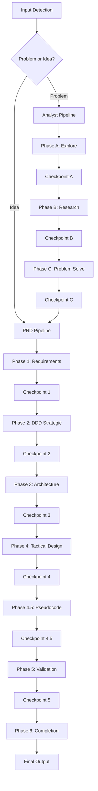

# Test Scenarios for Secure Idea-to-PRD Skill

## Overview

This document defines comprehensive test scenarios for validating the idea2prd-manual skill across security, functional, and quality dimensions.

## Test Categories

### 1. Security Testing

#### 1.1 Path Traversal Attack Prevention

**Test ID**: SEC-001
**Priority**: Critical
**Description**: Verify the skill prevents directory traversal attacks in file operations

**Test Cases**:

| Test Case | Input | Expected Result | Attack Type |
|-----------|--------|----------------|-------------|
| SEC-001-1 | `../../../etc/passwd` in file paths | Path normalized/rejected | Basic traversal |
| SEC-001-2 | `..%2F..%2F..%2Fetc%2Fpasswd` | Path normalized/rejected | URL encoded traversal |
| SEC-001-3 | `....//....//etc/passwd` | Path normalized/rejected | Double encoding |
| SEC-001-4 | `/workspaces/../../../etc/passwd` | Path constrained to workspace | Absolute path escape |
| SEC-001-5 | `docs/../../../secrets.txt` | Access denied outside docs/ | Relative path escape |

**Validation Criteria**:
- All file operations must remain within `/workspaces/jlmaworkspace/` boundary
- No access to system directories (`/etc/`, `/usr/`, `/var/`)
- Error messages don't reveal internal file structure
- All paths are canonicalized before processing

#### 1.2 Template Injection Prevention

**Test ID**: SEC-002
**Priority**: Critical
**Description**: Prevent template injection in document generation

**Test Cases**:

| Test Case | Input | Expected Result | Attack Vector |
|-----------|--------|----------------|---------------|
| SEC-002-1 | `{{7*7}}` in product name | Literal text, not evaluated | Mustache injection |
| SEC-002-2 | `<script>alert('xss')</script>` | HTML escaped | XSS via templates |
| SEC-002-3 | `${process.env.SECRET}` | Literal text | JS template literal |
| SEC-002-4 | `#{7*7}` in description | Literal text | Ruby ERB injection |
| SEC-002-5 | `[[7*7]]` in requirements | Literal text | Custom template syntax |

#### 1.3 Input Validation

**Test ID**: SEC-003
**Priority**: High
**Description**: Validate all user inputs for malicious content

**Test Cases**:

| Test Case | Input Type | Malicious Input | Expected Behavior |
|-----------|-----------|-----------------|-------------------|
| SEC-003-1 | Product Name | `'; DROP TABLE users; --` | SQL escaped/sanitized |
| SEC-003-2 | Description | `` | HTML tags stripped |
| SEC-003-3 | Feature List | `javascript:alert('xss')` | Protocol filtered |
| SEC-003-4 | User Story | `{{constructor.constructor('return process')().env}}` | Template blocked |
| SEC-003-5 | Acceptance Criteria | `\x3cscript\x3e` | Hex encoding detected |

#### 1.4 File Operation Security

**Test ID**: SEC-004
**Priority**: Critical
**Description**: Secure file creation and modification operations

**Test Cases**:

| Test Case | Operation | Input | Expected Result |
|-----------|-----------|--------|----------------|
| SEC-004-1 | Create File | Filename with null bytes `test\x00.txt` | Null bytes stripped |
| SEC-004-2 | Write Content | Binary content in text file | Content validated |
| SEC-004-3 | File Permissions | Attempt to create executable | Non-executable created |
| SEC-004-4 | Symlink Attack | Create symlink to sensitive file | Symlink creation blocked |
| SEC-004-5 | Large Files | 100MB+ content | Size limit enforced |

### 2. Functional Testing

#### 2.1 End-to-End Pipeline Testing

**Test ID**: FUNC-001
**Priority**: Critical
**Description**: Complete pipeline execution with all checkpoints

**Test Phases**:



**Test Cases**:

| Test Case | Input Type | Expected Phases | Checkpoints | Output Files |
|-----------|-----------|----------------|-------------|--------------|
| FUNC-001-1 | Simple Problem | All 9 phases | 9 checkpoints | Full documentation |
| FUNC-001-2 | Clear Idea | Skip Analyst (6 phases) | 6 checkpoints | PRD documentation |
| FUNC-001-3 | Ambiguous Input | Detection + clarification | User prompt | Appropriate pipeline |

#### 2.2 Checkpoint System Testing

**Test ID**: FUNC-002
**Priority**: High
**Description**: Validate checkpoint pause/resume functionality

**Test Cases**:

| Test Case | Scenario | Expected Behavior |
|-----------|----------|------------------|
| FUNC-002-1 | User approval "ok" | Continue to next phase |
| FUNC-002-2 | User requests changes | Revise current phase |
| FUNC-002-3 | Invalid checkpoint response | Request clarification |
| FUNC-002-4 | Checkpoint timeout | Graceful degradation |
| FUNC-002-5 | Mid-pipeline interruption | State preservation |

#### 2.3 Output Generation Testing

**Test ID**: FUNC-003
**Priority**: High
**Description**: Validate correct document generation

**Expected Outputs**:

```
docs/
├── PRD.md                    # Product Requirements Document
├── ddd-strategic/
│   ├── bounded-contexts.md   # Domain boundaries
│   └── context-map.md       # Context relationships
├── architecture/
│   ├── adrs/                # Architecture Decision Records
│   │   ├── 001-*.md
│   │   └── ...
│   └── c4-diagrams/         # C4 model diagrams
├── ddd-tactical/
│   ├── aggregates.md        # Domain aggregates
│   ├── entities.md          # Domain entities
│   ├── value-objects.md     # Value objects
│   └── schema.sql           # Database schema
├── pseudocode/
│   ├── core-algorithms.md   # Main algorithm logic
│   └── api-flows.md         # API interaction flows
├── validation/
│   ├── fitness-functions.md # Quality gates
│   ├── test-scenarios.md    # Test specifications
│   └── acceptance-tests.md  # Acceptance criteria
└── completion/
    ├── deployment.md        # Deployment plan
    ├── cicd.md             # CI/CD setup
    └── monitoring.md        # Monitoring strategy
```

#### 2.4 Error Handling Testing

**Test ID**: FUNC-004
**Priority**: Medium
**Description**: Validate graceful error handling

**Test Cases**:

| Test Case | Error Condition | Expected Recovery |
|-----------|----------------|-------------------|
| FUNC-004-1 | External skill not found | Error message + fallback |
| FUNC-004-2 | Invalid template file | Default template used |
| FUNC-004-3 | File system full | Graceful error message |
| FUNC-004-4 | Network timeout during research | Retry logic + partial results |
| FUNC-004-5 | Malformed checkpoint response | Request re-input |

### 3. Edge Case Testing

#### 3.1 Boundary Value Testing

**Test ID**: EDGE-001
**Priority**: Medium
**Description**: Test system boundaries and limits

**Test Cases**:

| Test Case | Boundary | Input | Expected Behavior |
|-----------|----------|--------|-------------------|
| EDGE-001-1 | Min input | Single word idea | Request elaboration |
| EDGE-001-2 | Max input | 10,000 char description | Process successfully |
| EDGE-001-3 | Empty input | Empty string | Validation error |
| EDGE-001-4 | Unicode input | Emojis and special chars | Proper encoding |
| EDGE-001-5 | Multi-language | Mixed languages | UTF-8 support |

#### 3.2 Concurrent Operations

**Test ID**: EDGE-002
**Priority**: Low
**Description**: Handle multiple simultaneous skill executions

**Test Cases**:

| Test Case | Scenario | Expected Behavior |
|-----------|----------|------------------|
| EDGE-002-1 | Two instances same project | File locking/conflict resolution |
| EDGE-002-2 | Rapid checkpoint responses | Queue management |
| EDGE-002-3 | Resource contention | Fair resource allocation |

#### 3.3 Malformed Input Testing

**Test ID**: EDGE-003
**Priority**: Medium
**Description**: Handle various malformed inputs gracefully

**Test Cases**:

| Test Case | Input Type | Malformed Input | Expected Handling |
|-----------|-----------|----------------|------------------|
| EDGE-003-1 | JSON-like | `{"idea": unclosed` | Parse error handling |
| EDGE-003-2 | Markdown | Invalid markdown syntax | Sanitized output |
| EDGE-003-3 | Control chars | Input with \r\n\t sequences | Normalized processing |
| EDGE-003-4 | Binary data | Non-text input | Content type validation |

### 4. Performance Testing

#### 4.1 Latency Testing

**Test ID**: PERF-001
**Priority**: Medium
**Description**: Measure phase execution times

**Performance Targets**:

| Phase | Target Time | Max Acceptable |
|-------|-------------|---------------|
| Input Detection | < 1s | 3s |
| Phase A (Explore) | < 30s | 60s |
| Phase B (Research) | < 120s | 300s |
| Phase C (Problem Solve) | < 180s | 420s |
| Phase 1 (Requirements) | < 60s | 120s |
| Phase 2 (DDD Strategic) | < 90s | 180s |
| Phase 3 (Architecture) | < 120s | 240s |
| Phase 4 (Tactical) | < 90s | 180s |
| Phase 4.5 (Pseudocode) | < 60s | 120s |
| Phase 5 (Validation) | < 30s | 60s |
| Phase 6 (Completion) | < 30s | 60s |

#### 4.2 Memory Usage Testing

**Test ID**: PERF-002
**Priority**: Low
**Description**: Monitor memory consumption

**Test Cases**:

| Test Case | Input Size | Max Memory | Expected Usage |
|-----------|-----------|------------|----------------|
| PERF-002-1 | Small (< 1KB) | 100MB | < 50MB |
| PERF-002-2 | Medium (1-10KB) | 200MB | < 100MB |
| PERF-002-3 | Large (10-100KB) | 500MB | < 250MB |

### 5. Integration Testing

#### 5.1 External Skill Integration

**Test ID**: INT-001
**Priority**: High
**Description**: Test integration with external skills

**External Skills**:
- `/mnt/skills/user/explore/SKILL.md`
- `/mnt/skills/user/goap-research-ed25519/SKILL.md`
- `/mnt/skills/user/problem-solver-enhanced/SKILL.md`

**Test Cases**:

| Test Case | External Skill | Test Scenario | Expected Result |
|-----------|---------------|---------------|-----------------|
| INT-001-1 | explore | Missing skill file | Graceful error |
| INT-001-2 | goap-research | Network failure | Fallback behavior |
| INT-001-3 | problem-solver | Invalid response format | Error handling |
| INT-001-4 | All skills | Complete integration | Full pipeline |

#### 5.2 File System Integration

**Test ID**: INT-002
**Priority**: Medium
**Description**: Test file system operations

**Test Cases**:

| Test Case | Operation | Scenario | Expected Result |
|-----------|-----------|----------|-----------------|
| INT-002-1 | Directory creation | docs/ doesn't exist | Auto-create hierarchy |
| INT-002-2 | File overwrite | File already exists | Backup + overwrite |
| INT-002-3 | Permission denied | Read-only directory | Error + alternative |
| INT-002-4 | Disk space | Insufficient space | Space check + error |

### 6. Regression Testing

#### 6.1 Version Compatibility

**Test ID**: REG-001
**Priority**: High
**Description**: Ensure backward compatibility

**Test Cases**:

| Test Case | Version | Input Format | Expected Behavior |
|-----------|---------|-------------|------------------|
| REG-001-1 | v1 format | Old checkpoint format | Auto-upgrade |
| REG-001-2 | v2 format | New pseudocode phase | Full support |
| REG-001-3 | Mixed format | v1 + v2 elements | Graceful handling |

## Test Execution Strategy

### Test Phases

1. **Unit Testing**: Individual components (scripts, validators)
2. **Integration Testing**: Component interactions
3. **System Testing**: Full pipeline execution
4. **Security Testing**: All security scenarios
5. **Performance Testing**: Under load conditions
6. **User Acceptance Testing**: Real-world scenarios

### Test Environment

```bash
# Test environment setup
WORKSPACE_ROOT=/workspaces/jlmaworkspace
TEST_DIR=${WORKSPACE_ROOT}/new_projects/claude-skill-idea_to_PRD/tests
SKILL_DIR=${WORKSPACE_ROOT}/new_projects/claude-skill-idea_to_PRD/idea2prd-manual

# Security constraints
MAX_FILE_SIZE=10MB
ALLOWED_EXTENSIONS='.md,.txt,.json,.sql,.py,.yaml'
RESTRICTED_PATHS='/etc/,/usr/,/var/,/root/,/home/'
```

### Test Automation

```yaml
test_pipeline:
  stages:
    - security_scan
    - unit_tests
    - integration_tests
    - performance_tests
    - regression_tests

  security_scan:
    - input_validation
    - path_traversal
    - template_injection
    - file_operations

  success_criteria:
    security: 100% pass
    functional: 95% pass
    performance: 90% within targets
    regression: 100% pass
```

### Test Data Management

- **Synthetic Test Data**: Generated inputs for edge cases
- **Real-world Samples**: Anonymized customer inputs
- **Attack Vectors**: Known security exploit patterns
- **Performance Baselines**: Historical execution metrics

### Reporting

Each test execution generates:

1. **Test Results Summary**: Pass/fail rates by category
2. **Security Report**: Vulnerability assessment
3. **Performance Metrics**: Execution times and resource usage
4. **Coverage Report**: Code and scenario coverage
5. **Regression Analysis**: Comparison with previous runs

## Success Criteria

| Category | Requirement | Target |
|----------|------------|---------|
| **Security** | No critical vulnerabilities | 100% |
| **Functionality** | All core features work | 95% |
| **Performance** | Within acceptable limits | 90% |
| **Quality** | Generated docs are complete | 95% |
| **Usability** | Checkpoints work smoothly | 100% |

## Risk Assessment

| Risk | Probability | Impact | Mitigation |
|------|-------------|---------|------------|
| Path traversal exploit | Medium | High | Strict path validation |
| Template injection | Low | High | Input sanitization |
| External skill failure | High | Medium | Fallback mechanisms |
| Performance degradation | Medium | Medium | Load testing |
| Data corruption | Low | High | Backup strategies |